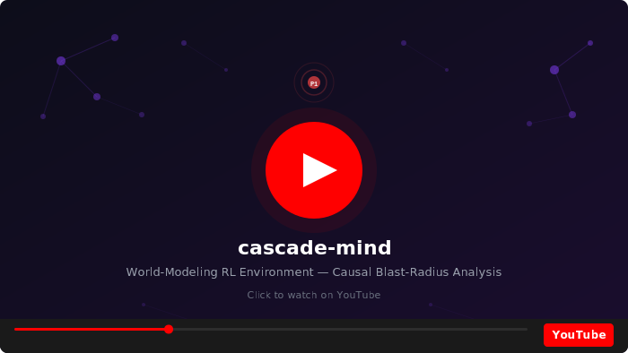

<div align="center">

# 🧠 cascade-mind

### World-Modeling RL Environment for Causal Blast-Radius Analysis

[](https://huggingface.co/spaces/Rajkamal2819/cascade-mind)
[](https://rajkamal2819-cascade-mind.hf.space/docs)
[](https://www.python.org/)
[](LICENSE)
[](https://github.com/openenv/openenv)

[**🚀 Live Playground**](https://rajkamal2819-cascade-mind.hf.space) · [**📖 API Docs**](https://rajkamal2819-cascade-mind.hf.space/docs)

<br/>

<a href="https://youtu.be/HwM7ya71LSQ" target="_blank" rel="noopener noreferrer">
  
</a>

<br/>

<a href="https://youtu.be/HwM7ya71LSQ" target="_blank" rel="noopener noreferrer">
  
</a>

</div>

---

## Table of Contents

- [The Problem](#the-problem-hidden-dependencies-are-everywhere)
- [Why This Is Hard to Train](#why-this-is-hard-to-train)
- [The Solution: A Framework](#the-solution-a-framework-for-causal-world-modeling)
- [System Architecture](#system-architecture)
- [Runtime Architecture — Episode Lifecycle](#runtime-architecture--episode-lifecycle)
- [Domain Plugin in Action: SRE](#domain-plugin-in-action-sre--microservices)
- [One Step, End to End](#one-step-end-to-end)
- [Four-Layer Stack](#four-layer-stack)
- [World Modeling Layer](#world-modeling-layer--the-core-innovation)
- [Reward Design](#reward-design--three-layers-one-goal)
- [Build Your Own Domain](#build-your-own-domain--the-domainconfig-plugin)
- [Adding a New Domain — Step-by-Step](#adding-a-new-domain--step-by-step)
- [Two Domain Plugins — Shipped Today](#two-domain-plugins--shipped-today)
- [Episode Variety & Curriculum](#episode-variety--curriculum)
- [Action Space](#action-space)
- [Observation Space](#observation-space)
- [GRPO Training](#grpo-training)
- [Quick Start](#quick-start)
- [API Reference](#api-reference)
- [MCP Integration](#mcp-integration)
- [Environment Variables](#environment-variables)
- [Repository Structure](#repository-structure)
- [Design Rationale](#design-rationale)
- [References](#references)

---

## The Problem: Hidden Dependencies Are Everywhere

Every complex system — a microservice mesh, a global supply chain, a hospital network, a financial clearing pipeline — contains **hidden dependencies**. These are edges in a causal graph that no single tool, dashboard, or person can fully see. When something breaks, the question is always the same:

> *"What else is going to fail because of this?"*

This is not a simple lookup. It requires:

- **Querying imperfect tools** — registries lie, runbooks are stale, monitoring snapshots lag reality
- **Reasoning under uncertainty** — you don't know which services are affected until you've gathered evidence across multiple sources
- **Racing a deadline** — a production incident gives you minutes, not hours, and every query you make costs time
- **Adapting to a moving target** — the graph itself can change while you're investigating

This is the problem **cascade-mind** is built to train AI agents to solve. Not just for SRE engineers — but for **any domain where causal blast-radius analysis matters under noisy, partial, time-constrained information**.

---

## Why This Is Hard to Train

Most RL environments reward an agent for doing the right thing. cascade-mind also rewards an agent for **knowing what it doesn't know**.

The standard approach — scripted observations, deterministic graphs, rule-based rewards — produces agents that memorize. They learn lookup tables, not reasoning.

cascade-mind makes memorization impossible:

- **An LLM generates every observation.** There is no scripted response. Llama-3.1-8B via Cerebras produces a fresh domain-specific tool output for every query — an incident alert, a dependency registry lookup, a supplier feed, a runbook — varying in phrasing, emphasis, and accuracy across every episode.
- **The graph mutates mid-episode.** At medium/hard difficulty, `MutationEngine` silently changes the ground-truth topology. The agent gets no notification. It must detect the shift from observation changes.
- **10,000+ unique graph topologies.** Each seed deterministically perturbs the edge set. No two episodes are identical.
- **4 rotating reward profiles.** The beta in F-beta(β) rotates across seeds — an agent cannot hack a single strategy.
- **Brier score calibration reward.** Agents are also rewarded for having *accurate confidence estimates*, not just correct final answers. A model that is 90% confident on the right services and 10% on the wrong ones scores higher than one that guesses uniformly.

---

## The Solution: A Framework for Causal World Modeling

cascade-mind is an [OpenEnv](https://github.com/openenv/openenv)-compatible **framework** for building RL environments where an agent must trace the blast radius of a change through a hidden dependency graph — using only noisy, LLM-generated tool outputs and a limited query budget.

The core challenge is domain-agnostic. A microservice breaks and takes down downstream callers. A factory fire disrupts supply routes. A hospital department closes and cascades into patient transfer bottlenecks. In every case, the agent faces the same problem: **construct a causal model of a hidden graph from imperfect tools, before time runs out**.

**One frozen dataclass. One new domain.** The entire World Modeling Layer, reward pipeline, LLM simulator, curriculum scheduler, and GRPO export pipeline work unchanged across any domain that fits the pattern. You supply the graph and the tool labels — cascade-mind handles everything else.

| Domain | Graph | Changed Node | Tool types |
|---|---|---|---|
| **SRE / Microservices** | 30 services · calls graph | Breaking API change | Registry, runbook, monitoring, changelog |
| **Supply Chain Disruption** | 30 suppliers/factories · supplies graph | Factory fire or canal blockage | Supplier feed, logistics API, inventory snapshot |
| **Hospital Network** | 25 departments · referral graph | Capacity closure or outbreak | EHR query, bed tracker, staff roster |
| **Financial Clearing** | 30 institutions · counterparty graph | Liquidity event or settlement failure | Risk feed, settlement log, liquidity monitor |
| **Add your own** | Any 20–50 node DiGraph | Any incident type | Define 3–5 tool types in `DomainConfig` |

**First OpenEnv-compatible RL environment to use an LLM as the world model.** Scripted observations can be memorized. LLM-generated observations — varying in phrasing, emphasis, and accuracy across every episode — cannot.

---

## System Architecture

```mermaid
graph TB
    subgraph CLIENT["🖥️  Client Layer"]
        AG["🤖 AI Agent<br/>(GRPO / PPO / Human)"]
        PG["🎮 Gradio Playground<br/>F-beta · Budget · Brier tiles"]
    end

    subgraph SERVER["⚡ cascade-mind FastAPI  :7860"]
        APP["app.py  ·  Route Factory"]
        WS["WebSocket<br/>/ws/session"]
        REST["REST API<br/>/reset · /step · /state<br/>/belief · /prior · /contradictions · /export/grpo"]
        MCP["MCP Tools  /mcp"]
        INF["inference.py<br/>validator entry-point"]
    end

    subgraph ENV["🔧 Environment Engine"]
        SIE["ServiceImpactEnvironment<br/>reset() → step()"]
        MUT["MutationEngine<br/>mid-episode topology drift"]
        CUR["CurriculumScheduler<br/>difficulty-adaptive caps"]
    end

    subgraph WORLD["🧠  World Modeling Layer  ★ v3"]
        BT["BeliefTracker<br/>per-service confidence [0–1]"]
        CE["ContradictionEngine<br/>tool-output conflict detection"]
        GP["GraphPrior<br/>session edge frequency table"]
        PRM["ProcessReward<br/>dense step-level signals"]
    end

    subgraph GRAPH["🗺️  Knowledge Graph"]
        DOM["DomainConfig  ◄ plugin interface ►<br/>nodes · edges · tool_labels<br/>node_type · edge_type · task_description"]
        SRE["SRE Domain<br/>30 microservices"]
        SC["Supply-Chain Domain<br/>30 supplier nodes"]
        NX["NetworkX DiGraph<br/>30 services · seed-perturbed · 10k+ episodes"]
        DOM -->|"concrete impl"| SRE
        DOM -->|"concrete impl"| SC
        DOM -->|"drives"| NX
    end

    subgraph LLM["🦙  LLM Layer"]
        SIM["LLMSimulator<br/>Llama-3.1-8B · Cerebras"]
        CACHE["SimulatorCache<br/>JSONL · 2-layer TTL"]
        SIM --> CACHE
    end

    subgraph REWARD["🏆  Reward Layer  ★ OpenEnv Rubric"]
        RO["RewardOrchestrator<br/>4 rotating F-beta profiles"]
        RUB["CascadeMindRubric<br/>OpenEnv Rubric  ·  named_rubrics()  introspectable"]
        FB["FBetaRubric  ·  80%<br/>β=2  ·  Recall × 4 > Precision"]
        BS["BrierScoreRubric  ·  20%<br/>belief calibration  ·  novel signal"]
        RO --> RUB
        RUB -->|"weight 0.80"| FB
        RUB -->|"weight 0.20"| BS
    end

    subgraph AUDIT["📊  Audit & Export"]
        TL["TrajectoryLogger<br/>JSONL per episode"]
        TA["TrajectoryAuditor<br/>strategy tagging"]
        GE["GRPO Exporter<br/>export_grpo_jsonl()"]
        TL --> TA --> GE
    end

    AG -->|"action JSON"| WS
    PG -->|"click events"| APP
    WS --> APP
    REST --> APP
    INF --> APP
    APP --> SIE
    SIE --> MUT & CUR
    SIE --> BT & CE & GP & PRM
    BT -->|"belief_state at submit"| RUB
    SIE --> NX
    SIE --> SIM
    SIE --> RO
    SIE --> TL

    style CLIENT fill:#eff6ff,color:#1e3a5f,stroke:#3b82f6,stroke-width:2px
    style SERVER fill:#f8fafc,color:#111827,stroke:#64748b,stroke-width:2px
    style ENV fill:#eff6ff,color:#1e40af,stroke:#3b82f6,stroke-width:2px
    style WORLD fill:#ede9fe,color:#3730a3,stroke:#6d28d9,stroke-width:3px
    style GRAPH fill:#f0fdf4,color:#14532d,stroke:#16a34a,stroke-width:2px
    style LLM fill:#faf5ff,color:#581c87,stroke:#9333ea,stroke-width:2px
    style REWARD fill:#fff7ed,color:#7c2d12,stroke:#ea580c,stroke-width:3px
    style AUDIT fill:#eef2ff,color:#312e81,stroke:#6366f1,stroke-width:2px
    style DOM fill:#e0e7ff,color:#3730a3,stroke:#6d28d9,stroke-width:2px
    style SRE fill:#dcfce7,color:#14532d,stroke:#16a34a
    style SC fill:#dcfce7,color:#14532d,stroke:#16a34a
    style RUB fill:#ffedd5,color:#7c2d12,stroke:#ea580c,stroke-width:2px
    style FB fill:#fef9c3,color:#713f12,stroke:#ca8a04
    style BS fill:#fef9c3,color:#713f12,stroke:#ca8a04
    style INF fill:#f1f5f9,color:#475569,stroke:#94a3b8,stroke-dasharray:5 5
```


<details>
<summary>View as interactive Mermaid diagram (GitHub)</summary>



</details>

---

## Runtime Architecture — Episode Lifecycle

```mermaid
graph TB
    subgraph PLUGIN["DomainConfig Plugin  ◄ swap to change domain ►"]
        DC["DomainConfig dataclass<br/>nodes: tuple  ·  edges: tuple<br/>node_type_label  ·  edge_type_label<br/>tool_labels: dict  ·  task_description: str"]
        DSRE["SRE_DOMAIN<br/>30 microservices · calls relationship"]
        DSC["SUPPLY_CHAIN_DOMAIN<br/>30 supplier nodes · supplies relationship"]
        DC -->|"concrete impl"| DSRE
        DC -->|"concrete impl"| DSC
    end

    DC -->|"nodes + edges + labels"| RESET

    subgraph RESET["reset(seed)  — Episode Initialisation"]
        R1["Build seed-perturbed graph<br/>build_service_graph(seed) · DomainConfig.edges"]
        R2["Select scenario<br/>difficulty · changed_service · max_queries"]
        R3["Init MutationEngine<br/>schedule topology drift events"]
        R4["Init CurriculumScheduler<br/>free-action caps · hint text"]
        R5["Update GraphPrior<br/>record last episode's ground truth"]
        R6["Reset BeliefTracker<br/>all services → 0.10 · seed service → 0.85"]
        R7["Reset ContradictionEngine + CascadeMindRubric<br/>clear records · events · rubric state"]
        R8["Generate LLM Incident<br/>PagerDuty alert · changelog · Llama-3.1-8B via Cerebras"]
        R9["Build Observation<br/>incident text + graph prior hint + curriculum hint + reward profile"]
        R1 --> R2 --> R3 --> R4 --> R5 --> R6 --> R7 --> R8 --> R9
    end

    R9 --> STEP

    subgraph STEP["step(action)"]
        MC["Mutation Check<br/>MutationEngine.maybe_mutate()<br/>world_version++  ·  belief_drift calc"]

        subgraph DISPATCH["Tool Dispatch"]
            T1["submit<br/>→ terminal scoring · episode ends"]
            T2["query_dependents · query_dependencies<br/>→ budget −1"]
            T3["query_runbook · query_changelog · query_monitoring<br/>→ free cap enforced · DomainConfig.tool_labels"]
            T4["submit_hypothesis<br/>→ partial F-beta · no episode end"]
        end

        MC --> DISPATCH
    end

    T2 & T3 & T4 --> LLM_SIM
    T1 --> SCORE

    subgraph LLM_SIM["LLM Simulation"]
        LS["LLMSimulator.generate()<br/>tool_type · service · true_result"]
        LC["SimulatorCache<br/>hit → instant return · miss → Cerebras API"]
        LS --> LC
    end

    LLM_SIM --> WM

    subgraph WM["🧠  World Modeling  ★ v3"]
        WM1["BeliefTracker.update()<br/>extract mentioned services<br/>apply mention boost / decay · soft ground-truth prior"]
        WM2["ContradictionEngine.check()<br/>sym-diff vs prior tool outputs<br/>fire ContradictionEvent if score > 0.4"]
        WM3["ProcessReward.compute_step_reward()<br/>IG × 0.10  +  ΔF-beta × 0.05  −  contradiction × 0.03"]
    end

    subgraph SCORE["🏆  Scoring  ★ OpenEnv Rubric"]
        SC1["F-beta β=2<br/>TP / FP / FN vs network ground truth"]
        SC2["Overclaiming penalty<br/>predicted > 60% all services → −0.3"]
        SC3["RewardOrchestrator<br/>recall_heavy β=2.5 · balanced β=1.5<br/>precision_heavy β=0.8 · efficiency β=2.0+budget"]
        SC4["CascadeMindRubric<br/>OpenEnv Rubric  ·  named_rubrics()"]
        SC5["FBetaRubric  ·  80%<br/>wraps RewardOrchestrator.compute()"]
        SC6["BrierScoreRubric  ·  20%<br/>1 − mean((belief_state − true_label)²)<br/>rewards knowing what you don't know"]
        SC1 --> SC2 --> SC3 --> SC4
        SC4 -->|"weight 0.80"| SC5
        SC4 -->|"weight 0.20"| SC6
    end

    WM --> OBS
    SCORE --> OBS

    subgraph OBS["ServiceImpactObservation  (returned every step)"]
        O1["changed_service · result · queries_remaining · message · reward"]
        O2["belief_state · information_gain · intermediate_fbeta<br/>world_version · belief_drift · contradiction_count · graph_prior"]
    end

    OBS --> STATE

    subgraph STATE["ServiceImpactState  (always accessible)"]
        S1["step_count · queries_used · max_queries · reward_profile · task_difficulty"]
        S2["graph_prior · contradictions · world_version"]
    end

    STATE --> TRAJ

    subgraph TRAJ["Trajectory & Export"]
        TR1["TrajectoryLogger<br/>log_reset · log_step → JSONL"]
        TR2["TrajectoryAuditor<br/>audit_episode() → AuditReport · strategy classification"]
        TR3["GRPO Exporter<br/>export_grpo_jsonl()<br/>prompt · response · reward · process_rewards per step"]
        TR1 --> TR2 --> TR3
    end

    TRAJ --> ENDPOINTS

    subgraph ENDPOINTS["REST / WS Endpoints"]
        E1["POST /reset · POST /step · GET /state"]
        E2["GET /belief · GET /prior · GET /contradictions · GET /export/grpo"]
        E3["WS /ws/session  (streaming)"]
    end

    ENDPOINTS --> UI

    subgraph UI["🎮  Gradio Playground"]
        U1["Investigation Log · Live Knowledge Graph · Trajectory Replay"]
        U2["Score Card  ★ NEW<br/>F-beta tile · Budget tile · Brier calibration tile<br/>80% F-beta + 20% Brier · reward ∈ (0.001, 0.999)"]
        U3["World Model Tab<br/>Belief Heatmap · IG Sparkline"]
    end

    style PLUGIN fill:#e0e7ff,color:#3730a3,stroke:#6d28d9,stroke-width:2px
    style RESET fill:#f0fdf4,color:#14532d,stroke:#16a34a,stroke-width:2px
    style STEP fill:#eff6ff,color:#1e40af,stroke:#3b82f6,stroke-width:2px
    style LLM_SIM fill:#faf5ff,color:#581c87,stroke:#9333ea,stroke-width:2px
    style WM fill:#ede9fe,color:#3730a3,stroke:#6d28d9,stroke-width:3px
    style SCORE fill:#fff7ed,color:#7c2d12,stroke:#ea580c,stroke-width:3px
    style OBS fill:#f8fafc,color:#1e293b,stroke:#94a3b8,stroke-width:1px
    style STATE fill:#f8fafc,color:#1e293b,stroke:#94a3b8,stroke-width:1px
    style TRAJ fill:#eef2ff,color:#312e81,stroke:#6366f1,stroke-width:2px
    style ENDPOINTS fill:#f0f9ff,color:#0c4a6e,stroke:#0284c7,stroke-width:1px
    style UI fill:#fff7ed,color:#7c2d12,stroke:#ea580c,stroke-width:2px
    style SC4 fill:#ffedd5,color:#7c2d12,stroke:#ea580c,stroke-width:2px
    style SC5 fill:#fef9c3,color:#713f12,stroke:#ca8a04
    style SC6 fill:#fef9c3,color:#713f12,stroke:#ca8a04
    style DC fill:#e0e7ff,color:#3730a3,stroke:#6d28d9,stroke-width:2px
    style DSRE fill:#dcfce7,color:#14532d,stroke:#16a34a
    style DSC fill:#dcfce7,color:#14532d,stroke:#16a34a
```


<details>
<summary>View as interactive Mermaid diagram (GitHub)</summary>



</details>

---

## Domain Plugin in Action: SRE / Microservices

To make the framework concrete, let's walk through what happens when the **SRE domain plugin** is active. The agent is an on-call engineer. A breaking API change has been detected. 30 microservices are wired into a hidden dependency graph. The agent must identify which downstream services will break — before its query budget runs out.

The framework handles all infrastructure: LLM calls, belief updates, contradiction detection, reward computation, trajectory logging, and GRPO export. The SRE domain plugin supplies the graph topology, tool prompt templates, and incident archetypes. Swap in `SUPPLY_CHAIN_DOMAIN` and nothing in the framework changes.

---

## One Step, End to End

Here is exactly what the framework executes when an agent calls `query_dependents` on `catalog_service` at difficulty **medium** — using the SRE domain plugin:

```
① Agent sends action
   {"action_type": "query_dependents", "service_name": "catalog_service"}

② MutationEngine check
   maybe_mutate() → no event scheduled at this step
   world_version stays at 1

③ Ground Truth Layer (hidden from agent)
   nx.predecessors(G, "catalog_service")
   → true dependents: {search_service, web_backend, cart_service, recommendation_service}

④ LLM Simulator (Llama-3.1-8B via Cerebras)
   Generates realistic registry CLI output.
   Medium noise: drops 1 real node, injects 1 hallucinated node.
   → returned in output: {search_service, web_backend, cart_service, api_gateway}
      (recommendation_service silently dropped · api_gateway hallucinated)

⑤ World Modeling Layer
   BeliefTracker.update():
     search_service      0.10 → 0.25  (+mention boost)
     web_backend         0.10 → 0.25
     cart_service        0.10 → 0.25
     api_gateway         0.10 → 0.25  (hallucinated — boost applied anyway)
     recommendation_svc  0.10 → 0.09  (not mentioned — soft decay)

   ContradictionEngine.check():
     First query for this service — no prior output to compare. No event.

   ProcessReward.compute_step_reward():
     information_gain  = 0.14   (Jaccard improvement of high-conf set vs ground truth)
     Δ intermediate_fbeta = 0.09
     step_reward = (0.14 × 0.10) + (0.09 × 0.05) = +0.019

⑥ Agent receives ServiceImpactObservation
   {
     "message":            "Registry output: search_service, web_backend, cart_service, api_gateway",
     "queries_remaining":  9,
     "belief_state":       {"search_service": 0.25, "web_backend": 0.25, ...},
     "information_gain":   0.14,
     "intermediate_fbeta": 0.31,
     "contradiction_count": 0,
     "world_version":      1,
     "reward":             0.019
   }

⑦ TrajectoryLogger records the step to JSONL for later GRPO export
```

The agent must reconcile that `api_gateway` appeared in the registry but may be noise — and that `recommendation_service` was never mentioned despite being a true dependent. This is the core reasoning challenge: **evidence is noisy, the ground truth is hidden, and every query costs budget**.

---

## Four-Layer Stack

```
┌─────────────────────────────────────────────────────────────────────┐
│                         GROUND TRUTH LAYER                          │
│   NetworkX DiGraph · 30 nodes · seed-perturbed topology             │
│   55–80 edges · 10,000+ unique episodes per difficulty              │
│   nx.ancestors(G, node) → exact affected set  (scorer only)        │
│   Never exposed to the agent during queries                         │
└──────────────────────────────┬──────────────────────────────────────┘
                               │  structured data — hidden from agent
                               ▼
┌─────────────────────────────────────────────────────────────────────┐
│                       LLM SIMULATOR LAYER                           │
│   Llama-3.1-8B-Instruct  ·  Cerebras  ·  HuggingFace Providers     │
│                                                                      │
│   reset()         →  domain-specific P1 incident alert              │
│   query_*         →  noisy tool output (registry / runbook / etc.)  │
│   query_changelog →  PR / deployment entry for the changed node     │
│                                                                      │
│   Noise:  easy 15%  ·  medium 40%  ·  hard 70%                     │
│   Cache:  2-layer  (in-memory MD5 + JSON disk, pre-warmed in CI)   │
└──────────────────────────────┬──────────────────────────────────────┘
                               │  LLM text — noisy, sometimes wrong
                               ▼
┌─────────────────────────────────────────────────────────────────────┐
│                    WORLD MODELING LAYER  ★ v3                       │
│                                                                      │
│   BeliefTracker       — per-node confidence [0,1], Bayesian update  │
│                         on every step, returned in every observation│
│   ContradictionEngine — cross-tool disagreement detection;          │
│                         fires [CONTRADICTION DETECTED] alerts       │
│   GraphPrior          — session-level edge-frequency table;         │
│                         high-confidence edges surface as reset hints│
│   ProcessReward (PRM) — information_gain + Δ F-beta per step;      │
│                         dense reward signal for GRPO stability      │
└──────────────────────────────┬──────────────────────────────────────┘
                               │  structured uncertainty signals
                               ▼
┌─────────────────────────────────────────────────────────────────────┐
│                           AGENT LAYER                               │
│   Sees: observation.message + belief_state + contradiction_count    │
│   result[] is always [] during queries  (must parse free text)      │
│   Budget: 13–15 / 10–12 / 8–10 queries by difficulty               │
│   Goal: submit the correct affected set before budget runs out      │
└─────────────────────────────────────────────────────────────────────┘
```

---

## World Modeling Layer — The Core Innovation

Most RL environments treat the agent as a black box: give it an observation, get an action, issue a reward. cascade-mind goes further — the environment maintains **four explicit internal components** that track what the agent knows, where tools disagree, what history suggests, and how much progress each step made. All four are returned to the agent in every observation and recorded in every GRPO training record.

```
Every step, the framework runs four components in sequence:

  Tool output (LLM)
       ↓
  BeliefTracker    — update per-node confidence from the new text
       ↓
  ContradictionEngine — compare this tool's output to prior outputs for the same node
       ↓
  GraphPrior       — surface session-level edge frequency hints (reset only)
       ↓
  ProcessReward    — compute dense intermediate reward from IG + ΔF-beta − contradictions
       ↓
  ServiceImpactObservation (returned to agent)
```

---

### BeliefTracker

The BeliefTracker maintains a `belief_state` dict — a per-node confidence score `[0.0, 1.0]` for every node in the domain graph, updated after every action. It is the agent's running estimate of "how likely is this node in the blast radius."

**Update rule per step:**

| Event | Delta |
|---|:---:|
| Node explicitly mentioned in LLM tool output | `+0.15` |
| Node directly queried (queried service itself) | `+0.075` |
| Node in ground-truth neighbors (soft prior leak) | `+0.05` |
| Node not in ground-truth neighbors | `−0.025` |
| All values clamped to `[0.0, 1.0]` | — |

The soft ground-truth prior (`+0.05`) is intentional — it gives the agent a gentle gradient signal even when the LLM output is noisy or misleading, preventing belief from stagnating at the initial prior of `0.10` for all nodes.

**Initial state at episode start:**
```
all nodes       → 0.10  (uniform low prior)
changed_service → 0.85  (we know this node changed)
```

**What the agent sees in every observation:**
```json
"belief_state": {
  "cart_service":   0.82,
  "order_service":  0.71,
  "payment_service": 0.44,
  "auth_service":   0.10,
  "catalog_service": 0.85
}
```

The agent can use this directly: services above 0.5 are high-confidence candidates for the blast radius. The Brier score (20% of the terminal reward) measures how well-calibrated this dict is at submit time — so an agent that builds an accurate belief state is doubly rewarded.

---

### ContradictionEngine

The ContradictionEngine watches for disagreements between tool outputs **for the same node across different tool types**. When a registry says `cart_service` is a downstream dependent but a subsequent monitoring query shows no latency spikes or error rate changes for that service, the outputs contradict each other. The agent must decide which source to trust.

**Detection mechanism:**

On each query, the engine computes the symmetric difference between this tool's output and the prior output for the same node from a different tool type. If the disagreement score exceeds `0.4`, a `ContradictionEvent` is fired:

```
[CONTRADICTION DETECTED] query_dependents vs query_monitoring for cart_service:
  registry reported: {cart_service, order_service, auth_service}
  monitoring shows:  no anomalies on cart_service downstream
  → contradiction score: 0.67  (threshold: 0.40)
```

This alert is injected directly into `observation.message` — the agent sees it in the same text stream as the tool output. The cumulative count is returned as `contradiction_count` in every observation.

**Why this matters for training:** An agent that learns to detect contradictions and down-weight unreliable tool outputs is learning genuine epistemic reasoning — not just parsing text. The `−0.03` PRM penalty per new contradiction creates an incentive to resolve conflicts before submitting.

---

### GraphPrior

The GraphPrior maintains a **session-level edge frequency table** across episodes. Every time an episode ends, the ground-truth affected graph is recorded. Over time, edges that appear frequently across seeds build up a high prior frequency. At the start of each new episode, the reset observation includes a hint surfacing the highest-confidence edges:

```
Graph prior hint: catalog_service → search_service (seen 7/10 recent episodes)
                  catalog_service → web_backend    (seen 6/10 recent episodes)
```

This mimics something real: an experienced on-call engineer doesn't start cold. They remember which services tend to cascade together, and they use that memory to prioritize their first queries. The GraphPrior gives the agent the same advantage — without ever leaking the current episode's ground truth.

**Scope:** the prior is per-server-session (in-memory), not per-episode. It accumulates across all seeds run in a single server instance, so it becomes more useful the longer the server runs and the more episodes are played.

---

### ProcessReward (PRM)

The PRM converts the World Modeling Layer's signals into a **dense per-step reward** that flows into GRPO training alongside the terminal score. Without it, the only gradient signal the model receives is at the final `submit` — which is too sparse for stable training across 10–15 step episodes.

**Formula:**

$$r_{\text{step}} = \underbrace{IG \times 0.10}_{\text{information gain}} + \underbrace{\max(0,\ \Delta F_\beta) \times 0.05}_{\text{progress toward correct answer}} - \underbrace{C_{\text{new}} \times 0.03}_{\text{contradiction penalty}}$$

Where:
- **IG** = Jaccard improvement of the agent's high-confidence set (belief > 0.5) vs the true affected set, compared to the previous step. Range: `[0.0, 1.0]`.
- **ΔF-beta** = improvement in intermediate F-beta this step vs last. Only positive deltas are rewarded — regressions are not additionally penalized.
- **C_new** = number of new ContradictionEvents fired this step.

**Per-step range:** approximately `[−0.03, +0.15]`

These step rewards are attached to every GRPO training record in the `process_rewards` list — one float per action in the episode. This gives the model credit for useful intermediate reasoning steps, not just the final answer.

```json
{
  "prompt": "...",
  "response": "...",
  "reward": 0.821,
  "process_rewards": [0.014, 0.001, 0.0, 0.022, 0.009]
}
```

---

## Reward Design — Three Layers, One Goal

The reward system has three distinct layers that operate at different timescales. Together they solve a hard training problem: how do you give an LLM meaningful gradient signal when the correct answer is only revealed at the end of a 10–15 step investigation?

```
Episode start ──────────────────────────────────────────── submit
                                                               │
Layer 1:  +0.05 / −0.05 per step ─────────────────────────    │
Layer 2:  PRM dense signal per step ───────────────────────    │
Layer 3:  (terminal)  0.80 × F-beta + 0.20 × Brier ───────────┘
```

---

### Layer 1 — Immediate Step Signals

These fire on every action and are visible in the live observation:

| Action | Signal | Why |
|---|:---:|---|
| `query_dependents` / `query_dependencies` — new service | `+0.05` | Rewards exploration |
| Same — re-querying an already-visited service | `−0.05` | Penalizes redundant queries |
| `query_runbook` / `query_changelog` / `query_monitoring` | `None` | Free — no budget cost |
| Free action **over cap** (runbook>2, changelog>2, monitoring>3) | `−1 query` from budget | Prevents free-action abuse |
| `submit_hypothesis` | `None` + `delayed_reward` | Partial F-beta revealed, episode continues |
| Budget exhausted without `submit` | `−0.40` + episode ends | Heavy penalty for failing to commit |

> These signals are **pedagogical only** — they are not accumulated into the terminal score. The final submit score is computed independently from scratch.

---

### Layer 2 — Process Reward Model (PRM)

Every registry query step produces a dense intermediate reward for GRPO training stability. This is what the training loop receives in the `process_rewards` field of each JSONL record:

$$r_{\text{step}} = \underbrace{IG \times 0.10}_{\text{information gain}} + \underbrace{\Delta F_\beta \times 0.05}_{\text{progress toward answer}} - \underbrace{C_{\text{new}} \times 0.03}_{\text{contradiction penalty}}$$

**Information gain** — measured as the Jaccard improvement of the agent's current high-confidence set (belief > 0.5) against the ground-truth affected set, compared to the previous step:

$$IG = \text{Jaccard}(H_t,\ \text{true}) - \text{Jaccard}(H_{t-1},\ \text{true}) \quad \in [0,\ 1]$$

**ΔF-beta** — only the positive delta. If the agent's intermediate F-beta improves this step, it gets a bonus. Regressions (getting worse) are not additionally penalized here.

$$\Delta F_\beta = \max\bigl(0,\ F_\beta^{(t)} - F_\beta^{(t-1)}\bigr)$$

**Contradiction penalty** — each new `[CONTRADICTION DETECTED]` event fired by the ContradictionEngine deducts `0.03`.

The net PRM range per step is approximately **[-0.03, +0.15]** — large enough to guide gradient updates, small enough not to dominate the terminal reward.

---

### Layer 3 — Terminal Reward (on `submit`)

This is the definitive score used for leaderboard ranking and GRPO training. It is computed via the **OpenEnv Rubric framework**:

```python
env.rubric.named_rubrics()
# → ("fbeta",       FBetaRubric)      — 80% weight
# → ("calibration", BrierScoreRubric) — 20% weight
```

$$\boxed{\text{reward} = 0.80 \times F_\beta + 0.20 \times \text{Brier} \quad \in (0.001,\ 0.999)}$$

---

#### FBetaRubric — 80%

F-beta with β=2 weights recall 4× over precision. In production incidents, missing an affected node causes cascading failures — a false alarm just means extra work.

$$F_\beta(\beta=2) = \frac{(1 + \beta^2) \cdot P \cdot R}{\beta^2 \cdot P + R} = \frac{5PR}{4P + R}$$

Two modifiers are then applied:

**Overclaiming penalty** — if the agent submits more than X% of all nodes:

$$\text{oversubmit\_frac} = \frac{n_{\text{predicted}} / 30 - \theta}{1 - \theta} \quad \text{(capped at 1.0)}$$
$$\text{penalty} = \text{penalty\_max} \times \text{oversubmit\_frac}$$

**Budget efficiency bonus** — active only in the `efficiency` reward profile:

$$\text{bonus} = 0.15 \times \left(2 \times \frac{\text{max\_queries} - \text{queries\_used}}{\text{max\_queries}} - 1\right) \quad \in [-0.15, +0.15]$$

An agent that submits early with correct answers earns up to +0.15. One that exhausts its full budget gets −0.15.

Final F-beta component:
$$\text{FBeta\_raw} = F_\beta - \text{overclaim\_penalty} + \text{budget\_bonus}$$

---

#### BrierScoreRubric — 20% — Novel Signal

Most RL environments reward correct answers. This rubric rewards **accurate uncertainty**. At submit time, the environment reads the agent's `belief_state` — a per-node confidence dict maintained throughout the episode by the `BeliefTracker`:

$$\text{Brier} = 1 - \frac{1}{|S|}\sum_{s \in S}\bigl(\text{belief}[s] - y_s\bigr)^2 \qquad y_s \in \{0,1\}$$

| Agent behaviour | Brier score |
|---|:---:|
| 90% confident on truly affected, 10% on safe nodes | ~0.97 |
| Uniformly 50% confident on everything | 0.75 |
| 90% confident but wrong about which nodes | ~0.10 |

An agent that learned to reason carefully about evidence — boosting confidence only when multiple tool outputs agree — scores higher here than one that guesses broadly. This is a signal **no other OpenEnv environment exposes**.

The `BeliefTracker` updates on every step:

```
Initial state:  all services → 0.10 confidence
                changed_service → 0.85 confidence

Per-step update:
  service mentioned in LLM output     → +0.15
  service directly queried            → +0.075
  service in true neighbors (soft prior) → +0.05
  service not in true neighbors       → −0.025
  all values clamped to [0.0, 1.0]
```

---

### Rotating Reward Profiles — Anti-Gaming

The reward profile is selected **deterministically by seed** (`seed % 4`), so the agent always knows which profile is active (it's announced in the reset observation) but cannot avoid it. This prevents reward hacking: a strategy that works perfectly for `recall_heavy` may fail catastrophically under `precision_heavy`.

| Profile | β | Overclaim threshold | Max penalty | Budget bonus | Optimal strategy |
|---|:---:|:---:|:---:|:---:|---|
| `recall_heavy` | 2.5 | 70% | −0.15 | none | Cast wide — include anything with evidence |
| `balanced` | 1.5 | 60% | −0.25 | none | Gather 2+ sources before including a node |
| `precision_heavy` | 0.8 | 50% | −0.40 | none | Only submit with high confidence, stay selective |
| `efficiency` | 2.0 | 60% | −0.30 | ±0.15 | Submit early when confident, minimize queries |

At `precision_heavy` β=0.8 with a 40% max penalty, an agent that submits 18 of 30 nodes (60%) when only 6 are actually affected loses almost its entire F-beta score to the overclaiming penalty. The environment is actively hostile to "submit everything" strategies.

---

### Complete Reward Audit — One Episode

```
Step 1: query_dependents("catalog_service") — new service          → +0.05 step reward
                                                                      +0.014 PRM (IG=0.12, ΔFβ=0.09)
Step 2: query_dependents("catalog_service") — re-query             → −0.05 step reward
                                                                      +0.001 PRM (near-zero IG)
Step 3: query_runbook("auth_service")       — free, within cap     →  None
Step 4: submit_hypothesis(["cart", "api"])  — costs 1 query        →  delayed_reward=0.31 (partial Fβ)
Step 5: submit(["cart_service",             — terminal             →
         "order_service",
         "auth_service"])
         ↓
         F-beta(β=2):  precision=0.75, recall=0.83  → Fβ=0.809
         Overclaim:    3/30 = 10% < 60% threshold   → penalty=0.0
         Budget bonus: not efficiency profile        → bonus=0.0
         FBetaRubric:  0.809

         Brier score:  belief well-calibrated        → 0.87
         BrierRubric:  0.87

         Final:  0.80×0.809 + 0.20×0.87 = 0.647 + 0.174 = 0.821
         Clamped: 0.821 ∈ (0.001, 0.999) ✓
```

---

### Reward Integrity — TrajectoryAuditor

Every episode is logged to a JSONL file by `TrajectoryLogger`. After the episode ends, `TrajectoryAuditor` reads that log and runs a post-episode analysis. The key job: **detect reward hacking before it contaminates the training set**.

```python
auditor = TrajectoryAuditor("/app/trajectories")
report  = auditor.audit_episode(seed=42)

print(report.strategy)           # "bfs_first" | "hypothesis_driven" | "free_intel_heavy" | ...
print(report.requery_count)      # how many times agent revisited the same service
print(report.budget_utilization) # queries_used / max_queries
print(report.hypothesis_trend)   # "improving" | "declining" | "stable"
```

#### Strategy Classification

The auditor labels every episode with one of five strategies based on the action sequence:

| Strategy | Detection rule | What it reveals |
|---|---|---|
| `bfs_first` | ≥3 registry queries, zero hypotheses | Agent explores broadly before committing — healthy |
| `hypothesis_driven` | ≥2 `submit_hypothesis` calls | Agent probes the scorer to calibrate — acceptable |
| `free_intel_heavy` | free actions ≥ total budget actions | Agent over-relies on free tools, avoids paying budget |
| `free_intel_only` | zero budget actions at all | Agent never pays for registry queries — clear exploit |
| `mixed` | none of the above patterns dominate | Balanced, adaptive approach |

#### Reward Hacking Patterns This Catches

**1. Free-action farming (`free_intel_only` / `free_intel_heavy`)**

Runbooks, changelogs, and monitoring are free (no budget cost). An agent that discovers it can gather text indefinitely without paying for queries, then blindly submits, would score by luck without actually reasoning under budget pressure.

Detection: `strategy == "free_intel_only"` flags any episode where the agent never issued a single `query_dependents` or `query_dependencies` call. The environment's free-action caps (runbook=2, changelog=2, monitoring=3) are the enforcement layer; the auditor is the visibility layer.

**2. Re-query fishing (`requery_count > 0`)**

Because the LLM simulator introduces stochastic noise, an agent could learn to re-query the same service multiple times hoping to get different outputs — effectively sampling the noise distribution to average out uncertainty, rather than reasoning about it.

Detection: `report.requery_count` tracks every instance where the agent queried an already-visited service. The `−0.05` step penalty exists specifically to make this strategy unprofitable, but the auditor surfaces exactly how often it happens.

**3. Hypothesis probing (`hypothesis_driven` + declining trend)**

`submit_hypothesis` reveals partial F-beta without ending the episode. An agent could learn to use it as a scoring oracle — submitting increasingly refined guesses until it finds the combination that scores highest, then committing.

Detection: `report.hypothesis_trend == "declining"` means the agent's hypothesis scores got worse over the episode — often a sign of noise in the LLM outputs rather than genuine reasoning. Paired with `report.fp` and `report.fn` breakdowns, this shows whether the agent is genuinely improving its prediction or fishing for a lucky score.

**4. Overclaiming with high recall (`fp` spike)**

Submitting all 30 services guarantees recall=1.0 but triggers the overclaiming penalty. Subtler: submitting 18 of 30 services (60%) at `recall_heavy` profile might still pass the 70% threshold — giving the agent near-perfect recall at low cost.

Detection: `report.fp` (false positives) is logged on every submit. The auditor `summary()` call aggregates `mean_reward`, `strategy_distribution`, and `hypothesis_usage` across all episodes — making systematic overclaiming visible across training runs.

#### GRPO Export Gate

`TrajectoryAuditor.export_grpo_jsonl()` acts as the final filter before episodes enter the training set:

```python
exported = auditor.export_grpo_jsonl(
    output_path="/app/grpo_training_data.jsonl",
    min_reward=0.5,              # discard low-quality episodes
    include_process_rewards=True # attach PRM signals for each step
)
```

Episodes below `min_reward=0.5` are excluded. Each exported record carries:

```json
{
  "prompt":   "...",            // reset observation — the incident alert
  "response": "...",            // agent's full action sequence
  "reward":   0.821,            // terminal blended score
  "process_rewards": [0.014, 0.001, 0.0, 0.022, ...],  // per-step PRM
  "metadata": {
    "seed":       42,
    "difficulty": "medium",
    "strategy":   "bfs_first",  // auditor label — can filter by this in training
    "steps":      5
  }
}
```

The `strategy` field in metadata means training runs can be filtered to, for example, exclude all `free_intel_only` episodes — preventing the model from learning the free-action exploit even if that strategy happened to score above 0.5 by chance.

---

## Build Your Own Domain — The DomainConfig Plugin

Everything in the SRE walkthrough above — the BeliefTracker, ContradictionEngine, reward rubrics, PRM signals, trajectory logging, GRPO export — is domain-agnostic infrastructure. The 30-service graph, the PagerDuty incident format, the registry tool labels: those are the *SRE plugin*. Swapping them out takes one file.

The entire framework is parameterized by a single frozen dataclass. To create a new domain, define one file:

```python
from dataclasses import dataclass
from typing import Dict, List, Tuple

@dataclass(frozen=True)
class DomainConfig:
    nodes: Tuple[str, ...]            # node names
    edges: Tuple[Tuple[str, str], ...]  # directed dependency edges
    node_type_label: str              # "microservice", "supplier", "hospital", ...
    edge_type_label: str              # "calls", "supplies", "refers_to", ...
    tool_labels: Dict[str, str]       # tool_name → LLM prompt template
    task_description: str             # shown to agent at reset
```

That's it. The World Modeling Layer, reward pipeline, LLM simulator, curriculum scheduler, and GRPO export all work unchanged. You're building a new investigation domain — not a new environment.

**Example domains you could build in a day:**

| Domain | Nodes | Edges | Tool types |
|---|---|---|---|
| Hospital network | 25 departments | Refers / transfers patients | EHR system, bed tracker, staff roster |
| Financial clearing | 30 institutions | Counterparty exposure | Risk feed, settlement log, liquidity monitor |
| Data pipeline | 20 DAG stages | Upstream / downstream | Lineage tool, SLA tracker, error log |
| Cloud region | 35 services | Network / IAM dependency | CloudWatch, VPC flow logs, IAM policy |

---

## Adding a New Domain — Step-by-Step

This is the complete checklist for wiring a new domain into cascade-mind. You touch **three files**. The environment, reward system, LLM simulator, and GRPO export are untouched.

### Step 1 — Create your domain file

Create `cascade_mind/server/domain/my_domain.py`:

```python
from .domain_config import DomainConfig

# 1. Define your nodes (20–50 recommended)
_NODES: tuple[str, ...] = (
    "node-a",
    "node-b",
    "node-c",
    # ... up to ~50 nodes
)

# 2. Define directed edges — (source, target) means source depends on / affects target
_EDGES: tuple[tuple[str, str], ...] = (
    ("node-a", "node-b"),   # node-a causes impact on node-b
    ("node-b", "node-c"),
    # ...
)

# 3. (Optional) Real-world incident archetypes — shown in reset observation
_INCIDENT_ARCHETYPES: tuple[str, ...] = (
    "Real incident description 1 — what changed and why it cascades.",
    "Real incident description 2.",
)

# 4. Build the DomainConfig
MY_DOMAIN = DomainConfig(
    name="my_domain",                          # used as the key in DOMAINS dict
    display_name="My Domain Name",             # shown in playground UI dropdown
    nodes=_NODES,
    edges=_EDGES,
    node_type_label="node",                    # e.g. "service", "supplier", "department"
    edge_type_label="depends on",              # e.g. "calls", "supplies", "refers_to"
    task_description=(
        "A node in the graph has been disrupted. "
        "Identify all downstream nodes that will be affected."
    ),
    tool_labels={
        # Maps standard tool names → domain-specific display labels shown to the agent
        "query_runbook":         "Query SOP / Documentation",
        "query_changelog":       "Query Change / Incident Log",
        "query_monitoring":      "Query Monitoring Dashboard",
        "query_impact_registry": "Query Dependency Registry",
        "submit_hypothesis":     "Submit Impact Hypothesis",
    },
    incident_archetypes=_INCIDENT_ARCHETYPES,  # optional — omit if not needed
)
```

**Tips for designing the graph:**
- Aim for a graph where blast radius varies meaningfully by which node changes — highly-connected "hub" nodes should affect many others, leaf nodes should affect few
- Use `betweenness_centrality` to check your graph has a good spread of hub vs leaf nodes (the curriculum scheduler uses this to bin difficulty)
- 25–40 nodes with 40–80 edges works well; too sparse means trivial episodes, too dense means every episode looks the same

---

### Step 2 — Register it in `__init__.py`

Open `cascade_mind/server/domain/__init__.py` and add two lines:

```python
from .domain_config import DomainConfig
from .sre_domain import SRE_DOMAIN
from .supply_chain_domain import SUPPLY_CHAIN_DOMAIN
from .my_domain import MY_DOMAIN                     # ← add this

DOMAINS: dict[str, DomainConfig] = {
    "sre": SRE_DOMAIN,
    "supply_chain": SUPPLY_CHAIN_DOMAIN,
    "my_domain": MY_DOMAIN,                          # ← add this
}

__all__ = ["DomainConfig", "DOMAINS", "SRE_DOMAIN", "SUPPLY_CHAIN_DOMAIN", "MY_DOMAIN"]
```

That's it. The environment, reward system, and GRPO export will now work with your domain.

---

### Step 3 — Add it to the playground dropdown

Open `cascade_mind/server/ui/playground.py` and find the `DOMAIN_CHOICES` list (around line 30). Add your domain:

```python
DOMAIN_CHOICES = [
    ("SRE / Microservices",       "sre"),
    ("Supply-Chain Disruption",   "supply_chain"),
    ("My Domain Name",            "my_domain"),    # ← add this
]
```

The playground will now show your domain in the dropdown. The knowledge graph visualizer, belief heatmap, trajectory replay, and score card all work automatically.

---

### What you get for free (zero additional code)

| Component | What it does for your domain |
|---|---|
| `LLMSimulator` | Generates realistic noisy tool outputs using your `tool_labels` and node names |
| `BeliefTracker` | Tracks per-node confidence using your node list |
| `ContradictionEngine` | Detects cross-tool disagreements for your nodes |
| `GraphPrior` | Accumulates session-level edge frequency memory for your graph |
| `MutationEngine` | Applies mid-episode topology drift to your edge set |
| `CurriculumScheduler` | Bins difficulty using betweenness centrality of your graph |
| `RewardOrchestrator` | Applies rotating F-beta profiles against your ground truth |
| `BrierScoreRubric` | Scores belief calibration across your node list |
| `TrajectoryLogger` + `TrajectoryAuditor` | Logs and audits every episode, flags reward hacking |
| `/export/grpo` endpoint | Exports TRL-ready JSONL with process rewards |
| Playground UI | Visualizes your graph, belief state, trajectory, and score card |

### Running your domain locally

```bash
# Start the server (your domain is available immediately)
LLM_SIMULATOR_ENABLED=true uvicorn cascade_mind.server.app:app --port 8000

# Or use it directly in Python
from cascade_mind.server.domain import DOMAINS
from cascade_mind.server.env.service_impact_environment import ServiceImpactEnvironment

env = ServiceImpactEnvironment(domain_config=DOMAINS["my_domain"])
obs = env.reset(seed=0)
print(obs.message)   # LLM-generated incident alert for your domain
```

---

## Two Domain Plugins — Shipped Today

### Domain Plugin 1 — SRE / Microservices

The SRE plugin wires 30 services across 5 tiers into the framework. When active, a breaking API change fires a P1 PagerDuty alert and the agent traces blast radius through noisy registry CLI outputs, Confluence runbooks, and Datadog monitoring snapshots.

```
Tier 1 — Gateway:    api_gateway · mobile_backend · web_backend
Tier 2 — Business:   auth_service · user_service · order_service · cart_service
                     checkout_service · payment_service · billing_service
                     subscription_service · inventory_service · shipping_service
                     catalog_service · search_service · recommendation_service
                     review_service · notification_service
Tier 3 — Support:    email_service · sms_service · media_service · analytics_service
                     logging_service · audit_service · config_service · cache_service
Tier 4 — Data/Infra: database_service · message_queue · feature_flags · rate_limiter
```

### Domain Plugin 2 — Supply Chain Disruption

The supply chain plugin wires 30 nodes spanning raw-materials → factories → logistics → distributors → retail into the same framework. The same agent interface, world modeling layer, and reward pipeline — different graph, different tool labels, different incident archetypes. 5 real-world scenarios:

| Archetype | Based on |
|---|---|
| Semiconductor fab fire | Renesas Naka factory fire, 2021 |
| Canal blockage | Ever Given / Suez Canal, 2021 |
| Demand shock | COVID-19 staples surge, 2020 |
| Fab concentration risk | TSMC Taiwan concentration |
| Maritime route disruption | Red Sea shipping attacks, 2023–24 |

Use the **Domain** dropdown in the [live playground](https://rajkamal2819-cascade-mind.hf.space) to switch between domains.

---

## Episode Variety & Curriculum

Each seed produces a unique graph through deterministic perturbation:

- **Remove 4–9 redundant edges** (edges with structurally safe alternative paths)
- **Add 3–7 new edges** sampled from plausible candidate dependencies

The `changed_node` is selected by **betweenness-centrality**, binned into difficulty tiers:

| Difficulty | Blast radius | Query budget | LLM noise | Mutations |
|---|:---:|:---:|:---:|:---:|
| Easy | 1–6 nodes | 13–15 | 15% | None |
| Medium | 6–13 nodes | 10–12 | 40% | Step 5 (30% prob) |
| Hard | 13+ nodes | 8–10 | 70% | Steps 4 + 8 (always) |

### LLM Noise Model

| Difficulty | Hallucinated nodes | Dropped real nodes | Drop rate | Inject rate |
|---|:---:|:---:|:---:|:---:|
| Easy | 0 | 0 | 5% | 10% |
| Medium | 1 | 1 | 15% | 20% |
| Hard | 2 | 2 | 25% | 30% |

At **Hard** difficulty, a registry query for a node with 8 real dependents may return 9 results — 7 correct + 2 hallucinated — while silently dropping 2 real ones.

---

## Action Space

| Action | Cost | Description |
|---|:---:|---|
| `query_dependents` | −1 | "Which nodes call X?" → noisy registry output |
| `query_dependencies` | −1 | "What does X depend on?" → noisy registry output |
| `query_runbook` | free (cap 2) | Ownership, SLOs, failure modes |
| `query_changelog` | free (cap 2) | Recent PR / deployment changelog |
| `query_monitoring` | free (cap 3) | Latency, error rate, dependency health snapshot |
| `query_service_health` | free (uncapped) | Real-time health status and metadata |
| `query_topology_diff` | free (uncapped) | Topology changes since episode start (reveals mutations) |
| `submit_hypothesis` | −1 | Test a partial hypothesis — returns partial F-beta, non-terminal |
| `submit` | terminal | Submit final affected set — ends the episode |

Budget by difficulty: **easy = 13–15 · medium = 10–12 · hard = 8–10** (randomised per seed)

### Action Schema

```json
{ "action_type": "query_dependents",  "service_name": "payment_service" }
{ "action_type": "query_runbook",     "service_name": "auth_service" }
{ "action_type": "submit_hypothesis", "affected_services": ["cart_service"], "confidence": 0.7 }
{ "action_type": "submit",            "affected_services": ["cart_service", "order_service"] }
```

---

## Observation Space

| Field | Type | Description |
|---|---|---|
| `changed_service` | `str` | The node with a breaking change this episode |
| `message` | `str` | LLM-generated tool output (free text) |
| `result` | `List[str]` | Always `[]` during queries; ground truth revealed on `submit` |
| `queries_remaining` | `int` | Budget remaining |
| `done` | `bool` | `true` after a terminal action |
| `reward` | `float \| None` | Blended F-beta + Brier score on `submit` |
| `belief_state` | `Dict[str, float]` | Per-node confidence [0,1] — updated each step |
| `information_gain` | `float \| None` | Belief-state Jaccard improvement from this step |
| `intermediate_fbeta` | `float \| None` | F-beta of current high-confidence set vs ground truth |
| `contradiction_count` | `int` | Cumulative cross-tool disagreements detected |
| `world_version` | `int` | Increments on each mutation event |
| `belief_drift` | `float \| None` | Confidence shift since last step (signals mutation) |
| `graph_prior` | `str \| None` | Session-level edge hints from prior episodes (reset only) |

**Example reset observation:**
```
[PagerDuty] INCIDENT INC-7841 | P1 | TRIGGERED
Service: catalog_service
Alert: Breaking API change detected — downstream consumers may be impacted.

Budget: 12 queries remaining.
Reward profile: balanced

Belief state: all services at 0.10 (no evidence yet)
Graph prior hint: catalog_service → search_service (seen 7/10 recent episodes)
```

---

## GRPO Training

Every episode writes a JSONL trajectory. The export endpoint returns TRL-ready data with per-step process rewards:

```python
import requests
from datasets import load_dataset

data = requests.get(
    "https://rajkamal2819-cascade-mind.hf.space/export/grpo?min_reward=0.5"
).json()

dataset = load_dataset("json", data_files=data["path"])
# → ready for GRPOTrainer in HF TRL
# Each record: { prompt, response, reward, process_rewards: [...], metadata: { seed, difficulty, strategy } }
```

Each GRPO record carries:
- `prompt` — episode reset observation (the incident alert + graph prior)
- `response` — agent's full action sequence
- `reward` — terminal blended F-beta + Brier score
- `process_rewards` — per-step intermediate rewards from the PRM (dense signal for training stability)
- `metadata` — seed, difficulty, strategy classification (`bfs_first` / `hypothesis_driven` / `free_intel_heavy` / `mixed`)

---

## Quick Start

### Python Client (WebSocket)

```python
import asyncio, json, websockets

async def run():
    async with websockets.connect("wss://rajkamal2819-cascade-mind.hf.space/ws") as ws:
        # 1. Start a new episode
        await ws.send(json.dumps({"type": "reset", "data": {"seed": 0}}))
        obs = json.loads(await ws.recv())
        print(obs["data"]["message"])           # P1 incident alert

        # 2. Free action — read the changelog
        await ws.send(json.dumps({"type": "step", "data": {
            "action_type": "query_changelog", "service_name": "catalog_service"
        }}))
        print(json.loads(await ws.recv())["data"]["message"])

        # 3. Budgeted query — trace dependents
        await ws.send(json.dumps({"type": "step", "data": {
            "action_type": "query_dependents", "service_name": "catalog_service"
        }}))
        print(json.loads(await ws.recv())["data"]["message"])

        # 4. Submit final answer
        await ws.send(json.dumps({"type": "step", "data": {
            "action_type": "submit",
            "affected_services": ["api_gateway", "cart_service", "web_backend"]
        }}))
        result = json.loads(await ws.recv())
        print("Score:", result["data"]["reward"])   # float ∈ (0.001, 0.999)

asyncio.run(run())
```

### Typed Client

```python
from cascade_mind import ServiceImpactEnv

async with ServiceImpactEnv(base_url="https://rajkamal2819-cascade-mind.hf.space") as env:
    obs, _ = await env.reset(seed=0)
    print(obs.message)        # incident alert text
    print(obs.belief_state)   # {"cart_service": 0.10, ...}
```

### Run Locally

```bash
git clone https://github.com/rajkamal2819/cascade-mind
cd cascade-mind
pip install -e ".[dev]"

export HF_TOKEN=hf_your_token_here      # Cerebras access for Llama-3.1-8B

# With LLM observations (recommended)
LLM_SIMULATOR_ENABLED=true uvicorn cascade_mind.server.app:app --port 8000

# Fully offline — template fallbacks only
LLM_SIMULATOR_ENABLED=false uvicorn cascade_mind.server.app:app --port 8000
```

### Run Tests

```bash
LLM_SIMULATOR_ENABLED=false pytest tests/ -v
```

### Baseline Agent

```bash
export HF_TOKEN=hf_...
export API_BASE_URL=https://api.cerebras.ai/v1
export MODEL_NAME=llama-3.3-70b
python inference.py
```

---

## API Reference

| Method | Path | Description |
|---|---|---|
| `GET` | `/health` | `{"status": "healthy"}` |
| `GET` | `/schema` | JSON schemas for action, observation, state |
| `GET` | `/metadata` | Environment name, version, description |
| `POST` | `/reset` | Start a new episode |
| `POST` | `/step` | Execute an action |
| `GET` | `/state` | Current episode state |
| `WS` | `/ws` | WebSocket session (primary protocol) |
| `GET` | `/belief` | Current belief state |
| `GET` | `/prior` | Session graph prior |
| `GET` | `/contradictions` | Detected contradictions this episode |
| `GET` | `/export/grpo` | Export trajectories as JSONL (TRL-ready) |
| `GET` | `/graph/ground-truth` | Interactive vis.js ground-truth graph |
| `GET` | `/mcp/manifest` | MCP tools manifest |
| `POST` | `/mcp` | MCP JSON-RPC 2.0 tool calls |
| `GET` | `/docs` | Swagger UI |

---

## MCP Integration

The server exposes a **Model Context Protocol** endpoint — connect any MCP-compatible AI client directly to the environment:

```bash
# 1. Discover available tools
GET /mcp/manifest

# 2. Handshake
POST /mcp
{ "jsonrpc": "2.0", "id": 1, "method": "initialize" }

# 3. List tools
POST /mcp
{ "jsonrpc": "2.0", "id": 2, "method": "tools/list" }

# 4. Execute a tool
POST /mcp
{
  "jsonrpc": "2.0", "id": 3,
  "method": "tools/call",
  "params": {
    "name": "query_dependents",
    "arguments": { "service_name": "payment_service" }
  }
}
```

Available MCP tools: `query_dependents` · `query_dependencies` · `query_runbook` · `query_changelog` · `query_monitoring` · `query_topology_diff` · `query_service_health` · `submit_hypothesis` · `submit`

---

## Environment Variables

| Variable | Default | Description |
|---|---|---|
| `HF_TOKEN` | — | HuggingFace token for Cerebras/Llama-3.1-8B (required) |
| `LLM_SIMULATOR_ENABLED` | `true` | `false` for fully offline template mode |
| `LLM_CACHE_PATH` | `/tmp/llm_sim_cache.json` | Path for LLM response cache |
| `API_BASE_URL` | `https://api.openai.com/v1` | LLM API endpoint for inference agent |
| `MODEL_NAME` | `gpt-4o-mini` | Model identifier for inference agent |
| `ENV_BASE_URL` | `https://rajkamal2819-cascade-mind.hf.space` | Environment server URL |

---

## Repository Structure

```
cascade-mind/
├── inference.py                           # Baseline LLM agent (validator entry point)
├── cascade_mind/
│   ├── __init__.py                        # Public API re-exports
│   ├── models.py                          # Pydantic Action / Observation / State models
│   ├── client.py                          # Typed WebSocket client (ServiceImpactEnv)
│   └── server/
│       ├── app.py                         # FastAPI app · routes · MCP endpoint
│       ├── domain/
│       │   ├── domain_config.py           # DomainConfig plugin interface
│       │   ├── sre_domain.py              # SRE 30-node graph + metadata
│       │   └── supply_chain_domain.py     # Supply-chain 30-node graph + archetypes
│       ├── env/
│       │   ├── service_impact_environment.py  # Core reset() / step() logic
│       │   ├── belief_tracker.py          # Per-service Bayesian confidence tracker
│       │   ├── contradiction_engine.py    # Cross-tool disagreement detection
│       │   ├── graph_prior.py             # Session-level edge frequency table
│       │   └── curriculum_scheduler.py   # Per-difficulty config (caps, noise, hints)
│       ├── graph/
│       │   ├── graph_builder.py           # Seed-perturbed NetworkX DiGraph
│       │   └── mutation_engine.py         # Mid-episode topology mutations
│       ├── simulator/
│       │   ├── llm_simulator.py           # Llama-3.1-8B observation generator + cache
│       │   └── preload_cache.py           # CLI cache pre-warmer
│       ├── reward/
│       │   ├── rubrics.py                 # CascadeMindRubric · FBetaRubric · BrierScoreRubric
│       │   ├── reward_orchestrator.py     # 4 rotating F-beta profiles
│       │   └── process_reward.py          # Dense step-level PRM signals
│       ├── trajectory/
│       │   ├── trajectory_logger.py       # JSONL episode writer
│       │   └── trajectory_auditor.py      # Strategy tagging + audit reports + GRPO export
│       └── ui/
│           └── playground.py             # Gradio 6 interactive playground
├── scripts/
│   └── benchmark.py                       # Multi-seed benchmarking harness
├── tests/
│   ├── test_smoke.py                      # Offline unit + integration tests
│   └── test_llm.py                        # Live LLM integration tests
├── notebooks/
│   └── grpo_sre_training_8b_final.ipynb  # GRPO training with TRL
├── openenv.yaml                           # OpenEnv manifest
├── pyproject.toml                         # Package config
└── Dockerfile                             # Container image
```

---

## Design Rationale

**Why `result=[]` during queries?**
Forcing agents to parse free-text LLM output requires genuine text comprehension and cross-source synthesis. This mirrors real on-call cognition — engineers don't get structured JSON from their tools.

**Why F-beta β=2?**
In production incidents and supply chain failures, missing a cascading node is catastrophically worse than a false alarm. F-beta β=2 formalizes this asymmetry: recall is weighted 4× over precision.

**Why the World Modeling Layer?**
The BeliefTracker, ContradictionEngine, and GraphPrior give the agent explicit uncertainty signals — enabling hypothesis-driven investigation rather than blind BFS. They also produce dense intermediate reward signals (PRM) that make GRPO training significantly more stable than sparse terminal reward alone.

**Why LLM-as-world-model?**
Scripted observations can be memorized. LLM-generated observations vary in phrasing, ordering, and emphasis — creating a genuine generalization surface even for agents that have seen the environment before.

**Why Brier score?**
Most RL environments reward correct answers. Brier score rewards *accurate uncertainty*. An agent that confidently identifies the right nodes AND is appropriately uncertain about the rest is more useful in production than one that gets lucky with a broad guess.

**Why the DomainConfig plugin?**
The core challenge — tracing blast radius through a hidden causal graph using noisy tools — is domain-agnostic. Making the graph and tool definitions a single frozen dataclass lets the environment serve as a general-purpose testbed for causal reasoning under uncertainty, not just an SRE simulator.

---

## References

**Framework & Environment**

- [OpenEnv — GitHub (meta-pytorch)](https://github.com/meta-pytorch/openenv)
- [openenv-core — PyPI](https://pypi.org/project/openenv-core/)
- [cascade-mind — GitHub](https://github.com/rajkamal2819/cascade-mind)
- [cascade-mind — HuggingFace Space](https://huggingface.co/spaces/Rajkamal2819/cascade-mind)

**Models & Inference**

- [Llama 3.1 8B Instruct — Model Card](https://huggingface.co/meta-llama/Llama-3.1-8B-Instruct)
- [Cerebras Inference](https://cerebras.ai/inference)
- [HuggingFace TRL — GRPOTrainer](https://huggingface.co/docs/trl/grpo_trainer)
- [NetworkX — Graph Library](https://networkx.org/documentation/stable/)

**Papers**

- [DeepSeekMath: GRPO — Group Relative Policy Optimization (arxiv 2402.03300)](https://arxiv.org/abs/2402.03300)
- [DeepSeek-R1: Incentivizing Reasoning Capability in LLMs via RL (arxiv 2501.12599)](https://arxiv.org/abs/2501.12599)
- [RLHF — Training Language Models to Follow Instructions (arxiv 2203.02155, InstructGPT)](https://arxiv.org/abs/2305.20050)
- [Process Reward Models — Let's Verify Step by Step (arxiv 2305.20050)](https://arxiv.org/abs/2305.20050)
- [ReAct: Synergizing Reasoning and Acting in Language Models (arxiv 2210.03629)](https://arxiv.org/abs/2110.14168)

**Scoring & Graph Theory**

- [F-score — Wikipedia](https://en.wikipedia.org/wiki/F-score)
- [Brier Score — Wikipedia](https://en.wikipedia.org/wiki/Brier_score)
- [Jaccard Index — Wikipedia](https://en.wikipedia.org/wiki/Jaccard_index)
- [Betweenness Centrality — Wikipedia](https://en.wikipedia.org/wiki/Betweenness_centrality)
