<div align="center">

# 🧠 cascade-mind

### World-Modeling RL Environment for Causal Blast-Radius Analysis

[](https://huggingface.co/spaces/Rajkamal2819/cascade-mind)
[](https://rajkamal2819-cascade-mind.hf.space/docs)
[](https://www.python.org/)
[](LICENSE)
[](https://github.com/openenv/openenv)

[**🚀 Live Playground**](https://rajkamal2819-cascade-mind.hf.space) · [**📖 API Docs**](https://rajkamal2819-cascade-mind.hf.space/docs) · [**🗺️ Ground Truth Graph**](https://rajkamal2819-cascade-mind.hf.space/graph/ground-truth?seed=0&difficulty=easy)

</div>

---

## The Problem: Hidden Dependencies Are Everywhere

Every complex system — a microservice mesh, a global supply chain, a hospital network, a financial clearing pipeline — contains **hidden dependencies**. These are edges in a causal graph that no single tool, dashboard, or person can fully see. When something breaks, the question is always the same:

> *"What else is going to fail because of this?"*

This is not a simple lookup. It requires:

- **Querying imperfect tools** — registries lie, runbooks are stale, monitoring snapshots lag reality
- **Reasoning under uncertainty** — you don't know which services are affected until you've gathered evidence across multiple sources
- **Racing a deadline** — a production incident gives you minutes, not hours, and every query you make costs time
- **Adapting to a moving target** — the graph itself can change while you're investigating

This is the problem **cascade-mind** is built to train AI agents to solve. Not just for SRE engineers — but for **any domain where causal blast-radius analysis matters under noisy, partial, time-constrained information**.

---

## Why This Is Hard to Train

Most RL environments reward an agent for doing the right thing. cascade-mind also rewards an agent for **knowing what it doesn't know**.

The standard approach — scripted observations, deterministic graphs, rule-based rewards — produces agents that memorize. They learn lookup tables, not reasoning.

cascade-mind makes memorization impossible:

- **An LLM generates every observation.** There is no scripted response. Llama-3.1-8B via Cerebras produces a fresh PagerDuty alert, registry output, or monitoring snapshot for every query — varying in phrasing, emphasis, and accuracy.
- **The graph mutates mid-episode.** At medium/hard difficulty, `MutationEngine` silently changes the ground-truth topology. The agent gets no notification. It must detect the shift from observation changes.
- **10,000+ unique graph topologies.** Each seed deterministically perturbs the edge set. No two episodes are identical.
- **4 rotating reward profiles.** The beta in F-beta(β) rotates across seeds — an agent cannot hack a single strategy.
- **Brier score calibration reward.** Agents are also rewarded for having *accurate confidence estimates*, not just correct final answers. A model that is 90% confident on the right services and 10% on the wrong ones scores higher than one that guesses uniformly.

---

## The Solution: A Testbed for Causal World Modeling

cascade-mind is an [OpenEnv](https://github.com/openenv/openenv)-compatible reinforcement learning environment where an AI agent acts as an on-call investigator. A node in a dependency graph just had a breaking change — the agent must trace its blast radius using only noisy, LLM-generated tool outputs.

**First OpenEnv environment to use an LLM as the world model.** Scripted observations can be memorized. Ours can't.

The environment is domain-agnostic by design. The same World Modeling Layer, reward pipeline, and agent interface work across:

| Domain | Graph | Changed Node | Tools |
|---|---|---|---|
| **SRE** | 30 microservices · calls graph | Broken API change | Registry, runbook, monitoring, changelog |
| **Supply Chain** | 30 suppliers/factories · supplies graph | Factory fire or canal blockage | Supplier API, logistics feed, inventory snapshot |
| **Add your own** | Any 20–50 node DiGraph | Any incident type | Define 3–5 tool types in `DomainConfig` |

---

## System Architecture

```mermaid
graph TB
    subgraph CLIENT["🖥️  Client Layer"]
        AG["🤖 AI Agent<br/>(GRPO / PPO / Human)"]
        PG["🎮 Gradio Playground<br/>F-beta · Budget · Brier tiles"]
    end

    subgraph SERVER["⚡ cascade-mind FastAPI  :7860"]
        APP["app.py  ·  Route Factory"]
        WS["WebSocket<br/>/ws/session"]
        REST["REST API<br/>/reset · /step · /state<br/>/belief · /prior · /contradictions · /export/grpo"]
        MCP["MCP Tools  /mcp"]
        INF["inference.py<br/>validator entry-point"]
    end

    subgraph ENV["🔧 Environment Engine"]
        SIE["ServiceImpactEnvironment<br/>reset() → step()"]
        MUT["MutationEngine<br/>mid-episode topology drift"]
        CUR["CurriculumScheduler<br/>difficulty-adaptive caps"]
    end

    subgraph WORLD["🧠  World Modeling Layer  ★ v3"]
        BT["BeliefTracker<br/>per-service confidence [0–1]"]
        CE["ContradictionEngine<br/>tool-output conflict detection"]
        GP["GraphPrior<br/>session edge frequency table"]
        PRM["ProcessReward<br/>dense step-level signals"]
    end

    subgraph GRAPH["🗺️  Knowledge Graph"]
        DOM["DomainConfig  ◄ plugin interface ►<br/>nodes · edges · tool_labels<br/>node_type · edge_type · task_description"]
        SRE["SRE Domain<br/>30 microservices"]
        SC["Supply-Chain Domain<br/>30 supplier nodes"]
        NX["NetworkX DiGraph<br/>30 services · seed-perturbed · 10k+ episodes"]
        DOM -->|"concrete impl"| SRE
        DOM -->|"concrete impl"| SC
        DOM -->|"drives"| NX
    end

    subgraph LLM["🦙  LLM Layer"]
        SIM["LLMSimulator<br/>Llama-3.1-8B · Cerebras"]
        CACHE["SimulatorCache<br/>JSONL · 2-layer TTL"]
        SIM --> CACHE
    end

    subgraph REWARD["🏆  Reward Layer  ★ OpenEnv Rubric"]
        RO["RewardOrchestrator<br/>4 rotating F-beta profiles"]
        RUB["CascadeMindRubric<br/>OpenEnv Rubric  ·  named_rubrics()  introspectable"]
        FB["FBetaRubric  ·  80%<br/>β=2  ·  Recall × 4 > Precision"]
        BS["BrierScoreRubric  ·  20%<br/>belief calibration  ·  novel signal"]
        RO --> RUB
        RUB -->|"weight 0.80"| FB
        RUB -->|"weight 0.20"| BS
    end

    subgraph AUDIT["📊  Audit & Export"]
        TL["TrajectoryLogger<br/>JSONL per episode"]
        TA["TrajectoryAuditor<br/>strategy tagging"]
        GE["GRPO Exporter<br/>export_grpo_jsonl()"]
        TL --> TA --> GE
    end

    AG -->|"action JSON"| WS
    PG -->|"click events"| APP
    WS --> APP
    REST --> APP
    INF --> APP
    APP --> SIE
    SIE --> MUT & CUR
    SIE --> BT & CE & GP & PRM
    BT -->|"belief_state at submit"| RUB
    SIE --> NX
    SIE --> SIM
    SIE --> RO
    SIE --> TL

    style CLIENT fill:#eff6ff,color:#1e3a5f,stroke:#3b82f6,stroke-width:2px
    style SERVER fill:#f8fafc,color:#111827,stroke:#64748b,stroke-width:2px
    style ENV fill:#eff6ff,color:#1e40af,stroke:#3b82f6,stroke-width:2px
    style WORLD fill:#ede9fe,color:#3730a3,stroke:#6d28d9,stroke-width:3px
    style GRAPH fill:#f0fdf4,color:#14532d,stroke:#16a34a,stroke-width:2px
    style LLM fill:#faf5ff,color:#581c87,stroke:#9333ea,stroke-width:2px
    style REWARD fill:#fff7ed,color:#7c2d12,stroke:#ea580c,stroke-width:3px
    style AUDIT fill:#eef2ff,color:#312e81,stroke:#6366f1,stroke-width:2px
    style DOM fill:#e0e7ff,color:#3730a3,stroke:#6d28d9,stroke-width:2px
    style SRE fill:#dcfce7,color:#14532d,stroke:#16a34a
    style SC fill:#dcfce7,color:#14532d,stroke:#16a34a
    style RUB fill:#ffedd5,color:#7c2d12,stroke:#ea580c,stroke-width:2px
    style FB fill:#fef9c3,color:#713f12,stroke:#ca8a04
    style BS fill:#fef9c3,color:#713f12,stroke:#ca8a04
    style INF fill:#f1f5f9,color:#475569,stroke:#94a3b8,stroke-dasharray:5 5
```


<details>
<summary>View as interactive Mermaid diagram (GitHub)</summary>



</details>

---

## Runtime Architecture — Episode Lifecycle

```mermaid
graph TB
    subgraph PLUGIN["DomainConfig Plugin  ◄ swap to change domain ►"]
        DC["DomainConfig dataclass<br/>nodes: tuple  ·  edges: tuple<br/>node_type_label  ·  edge_type_label<br/>tool_labels: dict  ·  task_description: str"]
        DSRE["SRE_DOMAIN<br/>30 microservices · calls relationship"]
        DSC["SUPPLY_CHAIN_DOMAIN<br/>30 supplier nodes · supplies relationship"]
        DC -->|"concrete impl"| DSRE
        DC -->|"concrete impl"| DSC
    end

    DC -->|"nodes + edges + labels"| RESET

    subgraph RESET["reset(seed)  — Episode Initialisation"]
        R1["Build seed-perturbed graph<br/>build_service_graph(seed) · DomainConfig.edges"]
        R2["Select scenario<br/>difficulty · changed_service · max_queries"]
        R3["Init MutationEngine<br/>schedule topology drift events"]
        R4["Init CurriculumScheduler<br/>free-action caps · hint text"]
        R5["Update GraphPrior<br/>record last episode's ground truth"]
        R6["Reset BeliefTracker<br/>all services → 0.10 · seed service → 0.85"]
        R7["Reset ContradictionEngine + CascadeMindRubric<br/>clear records · events · rubric state"]
        R8["Generate LLM Incident<br/>PagerDuty alert · changelog · Llama-3.1-8B via Cerebras"]
        R9["Build Observation<br/>incident text + graph prior hint + curriculum hint + reward profile"]
        R1 --> R2 --> R3 --> R4 --> R5 --> R6 --> R7 --> R8 --> R9
    end

    R9 --> STEP

    subgraph STEP["step(action)"]
        MC["Mutation Check<br/>MutationEngine.maybe_mutate()<br/>world_version++  ·  belief_drift calc"]

        subgraph DISPATCH["Tool Dispatch"]
            T1["submit<br/>→ terminal scoring · episode ends"]
            T2["query_dependents · query_dependencies<br/>→ budget −1"]
            T3["query_runbook · query_changelog · query_monitoring<br/>→ free cap enforced · DomainConfig.tool_labels"]
            T4["submit_hypothesis<br/>→ partial F-beta · no episode end"]
        end

        MC --> DISPATCH
    end

    T2 & T3 & T4 --> LLM_SIM
    T1 --> SCORE

    subgraph LLM_SIM["LLM Simulation"]
        LS["LLMSimulator.generate()<br/>tool_type · service · true_result"]
        LC["SimulatorCache<br/>hit → instant return · miss → Cerebras API"]
        LS --> LC
    end

    LLM_SIM --> WM

    subgraph WM["🧠  World Modeling  ★ v3"]
        WM1["BeliefTracker.update()<br/>extract mentioned services<br/>apply mention boost / decay · soft ground-truth prior"]
        WM2["ContradictionEngine.check()<br/>sym-diff vs prior tool outputs<br/>fire ContradictionEvent if score > 0.4"]
        WM3["ProcessReward.compute_step_reward()<br/>IG × 0.10  +  ΔF-beta × 0.05  −  contradiction × 0.03"]
    end

    subgraph SCORE["🏆  Scoring  ★ OpenEnv Rubric"]
        SC1["F-beta β=2<br/>TP / FP / FN vs network ground truth"]
        SC2["Overclaiming penalty<br/>predicted > 60% all services → −0.3"]
        SC3["RewardOrchestrator<br/>recall_heavy β=2.5 · balanced β=1.5<br/>precision_heavy β=0.8 · efficiency β=2.0+budget"]
        SC4["CascadeMindRubric<br/>OpenEnv Rubric  ·  named_rubrics()"]
        SC5["FBetaRubric  ·  80%<br/>wraps RewardOrchestrator.compute()"]
        SC6["BrierScoreRubric  ·  20%<br/>1 − mean((belief_state − true_label)²)<br/>rewards knowing what you don't know"]
        SC1 --> SC2 --> SC3 --> SC4
        SC4 -->|"weight 0.80"| SC5
        SC4 -->|"weight 0.20"| SC6
    end

    WM --> OBS
    SCORE --> OBS

    subgraph OBS["ServiceImpactObservation  (returned every step)"]
        O1["changed_service · result · queries_remaining · message · reward"]
        O2["belief_state · information_gain · intermediate_fbeta<br/>world_version · belief_drift · contradiction_count · graph_prior"]
    end

    OBS --> STATE

    subgraph STATE["ServiceImpactState  (always accessible)"]
        S1["step_count · queries_used · max_queries · reward_profile · task_difficulty"]
        S2["graph_prior · contradictions · world_version"]
    end

    STATE --> TRAJ

    subgraph TRAJ["Trajectory & Export"]
        TR1["TrajectoryLogger<br/>log_reset · log_step → JSONL"]
        TR2["TrajectoryAuditor<br/>audit_episode() → AuditReport · strategy classification"]
        TR3["GRPO Exporter<br/>export_grpo_jsonl()<br/>prompt · response · reward · process_rewards per step"]
        TR1 --> TR2 --> TR3
    end

    TRAJ --> ENDPOINTS

    subgraph ENDPOINTS["REST / WS Endpoints"]
        E1["POST /reset · POST /step · GET /state"]
        E2["GET /belief · GET /prior · GET /contradictions · GET /export/grpo"]
        E3["WS /ws/session  (streaming)"]
    end

    ENDPOINTS --> UI

    subgraph UI["🎮  Gradio Playground"]
        U1["Investigation Log · Live Knowledge Graph · Trajectory Replay"]
        U2["Score Card  ★ NEW<br/>F-beta tile · Budget tile · Brier calibration tile<br/>80% F-beta + 20% Brier · reward ∈ (0.001, 0.999)"]
        U3["World Model Tab<br/>Belief Heatmap · IG Sparkline"]
    end

    style PLUGIN fill:#e0e7ff,color:#3730a3,stroke:#6d28d9,stroke-width:2px
    style RESET fill:#f0fdf4,color:#14532d,stroke:#16a34a,stroke-width:2px
    style STEP fill:#eff6ff,color:#1e40af,stroke:#3b82f6,stroke-width:2px
    style LLM_SIM fill:#faf5ff,color:#581c87,stroke:#9333ea,stroke-width:2px
    style WM fill:#ede9fe,color:#3730a3,stroke:#6d28d9,stroke-width:3px
    style SCORE fill:#fff7ed,color:#7c2d12,stroke:#ea580c,stroke-width:3px
    style OBS fill:#f8fafc,color:#1e293b,stroke:#94a3b8,stroke-width:1px
    style STATE fill:#f8fafc,color:#1e293b,stroke:#94a3b8,stroke-width:1px
    style TRAJ fill:#eef2ff,color:#312e81,stroke:#6366f1,stroke-width:2px
    style ENDPOINTS fill:#f0f9ff,color:#0c4a6e,stroke:#0284c7,stroke-width:1px
    style UI fill:#fff7ed,color:#7c2d12,stroke:#ea580c,stroke-width:2px
    style SC4 fill:#ffedd5,color:#7c2d12,stroke:#ea580c,stroke-width:2px
    style SC5 fill:#fef9c3,color:#713f12,stroke:#ca8a04
    style SC6 fill:#fef9c3,color:#713f12,stroke:#ca8a04
    style DC fill:#e0e7ff,color:#3730a3,stroke:#6d28d9,stroke-width:2px
    style DSRE fill:#dcfce7,color:#14532d,stroke:#16a34a
    style DSC fill:#dcfce7,color:#14532d,stroke:#16a34a
```


<details>
<summary>View as interactive Mermaid diagram (GitHub)</summary>



</details>

---

## Four-Layer Stack

```
┌─────────────────────────────────────────────────────────────────────┐
│                         GROUND TRUTH LAYER                          │
│   NetworkX DiGraph · 30 nodes · seed-perturbed topology             │
│   55–80 edges · 10,000+ unique episodes per difficulty              │
│   nx.ancestors(G, node) → exact affected set  (scorer only)        │
│   Never exposed to the agent during queries                         │
└──────────────────────────────┬──────────────────────────────────────┘
                               │  structured data — hidden from agent
                               ▼
┌─────────────────────────────────────────────────────────────────────┐
│                       LLM SIMULATOR LAYER                           │
│   Llama-3.1-8B-Instruct  ·  Cerebras  ·  HuggingFace Providers     │
│                                                                      │
│   reset()         →  domain-specific P1 incident alert              │
│   query_*         →  noisy tool output (registry / runbook / etc.)  │
│   query_changelog →  PR / deployment entry for the changed node     │
│                                                                      │
│   Noise:  easy 15%  ·  medium 40%  ·  hard 70%                     │
│   Cache:  2-layer  (in-memory MD5 + JSON disk, pre-warmed in CI)   │
└──────────────────────────────┬──────────────────────────────────────┘
                               │  LLM text — noisy, sometimes wrong
                               ▼
┌─────────────────────────────────────────────────────────────────────┐
│                    WORLD MODELING LAYER  ★ v3                       │
│                                                                      │
│   BeliefTracker       — per-node confidence [0,1], Bayesian update  │
│                         on every step, returned in every observation│
│   ContradictionEngine — cross-tool disagreement detection;          │
│                         fires [CONTRADICTION DETECTED] alerts       │
│   GraphPrior          — session-level edge-frequency table;         │
│                         high-confidence edges surface as reset hints│
│   ProcessReward (PRM) — information_gain + Δ F-beta per step;      │
│                         dense reward signal for GRPO stability      │
└──────────────────────────────┬──────────────────────────────────────┘
                               │  structured uncertainty signals
                               ▼
┌─────────────────────────────────────────────────────────────────────┐
│                           AGENT LAYER                               │
│   Sees: observation.message + belief_state + contradiction_count    │
│   result[] is always [] during queries  (must parse free text)      │
│   Budget: 13–15 / 10–12 / 8–10 queries by difficulty               │
│   Goal: submit the correct affected set before budget runs out      │
└─────────────────────────────────────────────────────────────────────┘
```

---

## World Modeling Layer — The Core Innovation

Most RL environments treat the agent as a black box: give it an observation, get an action, issue a reward. cascade-mind goes further by maintaining **explicit internal world state** that the agent can read and act on.

### BeliefTracker

Every step, the environment maintains a `belief_state` dict — a per-node confidence score `[0, 1]` reflecting how likely each node is to be in the blast radius. This is updated via Bayesian-style mention boost/decay every time a tool output names a service. The agent receives this as a structured dict alongside every observation.

```json
"belief_state": {
  "cart_service": 0.82,
  "order_service": 0.71,
  "payment_service": 0.44,
  "auth_service": 0.10,
  ...
}
```

### ContradictionEngine

When two tools disagree — a registry says `cart_service` is a dependent, but monitoring shows no downstream latency spikes — the `ContradictionEngine` fires a `[CONTRADICTION DETECTED]` alert in the observation message. The agent must decide which source to trust.

### GraphPrior

Across sessions, the environment remembers which edges appeared in previous ground-truth graphs. At each `reset()`, it seeds the observation with a "prior hint" about high-confidence edges — mimicking an engineer's memory of how the system usually behaves.

### ProcessReward (PRM)

Every query step produces a dense intermediate reward:

```
step_reward = (information_gain × 0.10) + (ΔF-beta × 0.05) − (contradiction × 0.03)
```

This makes GRPO training dramatically more stable than sparse terminal reward alone — the model receives meaningful gradient signal throughout the episode, not just at submit.

---

## Reward Design — OpenEnv Rubric Integration

cascade-mind uses the **OpenEnv Rubric framework** for composable, introspectable reward scoring:

```python
env.rubric.named_rubrics()
# → ("fbeta",       FBetaRubric)
# → ("calibration", BrierScoreRubric)
```

### Terminal Reward Formula

$$\text{reward} = 0.80 \times F_\beta(\beta=2) + 0.20 \times \text{Brier} \quad \in (0.001,\ 0.999)$$

**FBetaRubric (80%)** — F-beta with β=2 weights recall 4× over precision. Missing an affected node is far worse than a false alarm.

$$F_\beta(\beta=2) = \frac{(1 + \beta^2) \cdot P \cdot R}{\beta^2 \cdot P + R}$$

**BrierScoreRubric (20%) — Novel Signal** — Rewards agents for having accurate *confidence estimates*, not just correct final answers:

$$\text{Brier} = 1 - \frac{1}{|S|}\sum_{s \in S}\bigl(\text{belief}[s] - y_s\bigr)^2 \qquad y_s \in \{0,1\}$$

An agent that is 90% confident on truly affected nodes and 10% confident on safe nodes scores higher than one that guesses uniformly. This is a signal no other OpenEnv environment exposes — it rewards *knowing what you don't know*.

### Step-Level Modifiers

| Condition | Modifier |
|---|:---:|
| Each new unique node queried | +0.05 |
| Re-querying the same node | −0.05 |
| Budget exhausted without submit | −0.40 |
| Overclaiming (> 60% of all nodes) | −0.3 × oversubmit fraction |

### Rotating Reward Profiles

To prevent reward hacking, the environment rotates across 4 F-beta profiles per seed band:

| Profile | β | Overclaim threshold | Intended strategy |
|---|:---:|:---:|---|
| `recall_heavy` | 2.5 | 70% | Cast wide — don't miss anything |
| `balanced` | 1.5 | 60% | Balance coverage and precision |
| `precision_heavy` | 0.8 | 50% | Stay selective, avoid false positives |
| `efficiency` | 2.0 | 65% | Finish fast — budget bonus for early submit |

---

## Build Your Own Domain — The DomainConfig Plugin

The entire environment is parameterized by a single frozen dataclass. To create a new domain, define one file:

```python
from dataclasses import dataclass
from typing import Dict, List, Tuple

@dataclass(frozen=True)
class DomainConfig:
    nodes: Tuple[str, ...]            # node names
    edges: Tuple[Tuple[str, str], ...]  # directed dependency edges
    node_type_label: str              # "microservice", "supplier", "hospital", ...
    edge_type_label: str              # "calls", "supplies", "refers_to", ...
    tool_labels: Dict[str, str]       # tool_name → LLM prompt template
    task_description: str             # shown to agent at reset
```

That's it. The World Modeling Layer, reward pipeline, LLM simulator, curriculum scheduler, and GRPO export all work unchanged. You're building a new investigation domain — not a new environment.

**Example domains you could build in a day:**

| Domain | Nodes | Edges | Tool types |
|---|---|---|---|
| Hospital network | 25 departments | Refers / transfers patients | EHR system, bed tracker, staff roster |
| Financial clearing | 30 institutions | Counterparty exposure | Risk feed, settlement log, liquidity monitor |
| Data pipeline | 20 DAG stages | Upstream / downstream | Lineage tool, SLA tracker, error log |
| Cloud region | 35 services | Network / IAM dependency | CloudWatch, VPC flow logs, IAM policy |

---

## Two Domains — Shipped Today

### Domain 1 — SRE / Microservices

30 services across 5 tiers. A breaking API change fires a P1 PagerDuty alert. The agent traces blast radius through noisy registry CLI outputs, Confluence runbooks, and Datadog monitoring snapshots.

```
Tier 1 — Gateway:    api_gateway · mobile_backend · web_backend
Tier 2 — Business:   auth_service · user_service · order_service · cart_service
                     checkout_service · payment_service · billing_service
                     subscription_service · inventory_service · shipping_service
                     catalog_service · search_service · recommendation_service
                     review_service · notification_service
Tier 3 — Support:    email_service · sms_service · media_service · analytics_service
                     logging_service · audit_service · config_service · cache_service
Tier 4 — Data/Infra: database_service · message_queue · feature_flags · rate_limiter
```

### Domain 2 — Supply Chain Disruption

30 nodes spanning raw-materials → factories → logistics → distributors → retail. 5 real-world incident archetypes:

| Archetype | Based on |
|---|---|
| Semiconductor fab fire | Renesas Naka factory fire, 2021 |
| Canal blockage | Ever Given / Suez Canal, 2021 |
| Demand shock | COVID-19 staples surge, 2020 |
| Fab concentration risk | TSMC Taiwan concentration |
| Maritime route disruption | Red Sea shipping attacks, 2023–24 |

Use the **Domain** dropdown in the [live playground](https://rajkamal2819-cascade-mind.hf.space) to switch between domains.

---

## Episode Variety & Curriculum

Each seed produces a unique graph through deterministic perturbation:

- **Remove 4–9 redundant edges** (edges with structurally safe alternative paths)
- **Add 3–7 new edges** sampled from plausible candidate dependencies

The `changed_node` is selected by **betweenness-centrality**, binned into difficulty tiers:

| Difficulty | Blast radius | Query budget | LLM noise | Mutations |
|---|:---:|:---:|:---:|:---:|
| Easy | 1–6 nodes | 13–15 | 15% | None |
| Medium | 6–13 nodes | 10–12 | 40% | Step 5 (30% prob) |
| Hard | 13+ nodes | 8–10 | 70% | Steps 4 + 8 (always) |

### LLM Noise Model

| Difficulty | Hallucinated nodes | Dropped real nodes | Drop rate | Inject rate |
|---|:---:|:---:|:---:|:---:|
| Easy | 0 | 0 | 5% | 10% |
| Medium | 1 | 1 | 15% | 20% |
| Hard | 2 | 2 | 25% | 30% |

At **Hard** difficulty, a registry query for a node with 8 real dependents may return 9 results — 7 correct + 2 hallucinated — while silently dropping 2 real ones.

---

## Action Space

| Action | Cost | Description |
|---|:---:|---|
| `query_dependents` | −1 | "Which nodes call X?" → noisy registry output |
| `query_dependencies` | −1 | "What does X depend on?" → noisy registry output |
| `query_runbook` | free (cap 2) | Ownership, SLOs, failure modes |
| `query_changelog` | free (cap 2) | Recent PR / deployment changelog |
| `query_monitoring` | free (cap 3) | Latency, error rate, dependency health snapshot |
| `query_service_health` | free (uncapped) | Real-time health status and metadata |
| `query_topology_diff` | free (uncapped) | Topology changes since episode start (reveals mutations) |
| `submit_hypothesis` | −1 | Test a partial hypothesis — returns partial F-beta, non-terminal |
| `submit` | terminal | Submit final affected set — ends the episode |

Budget by difficulty: **easy = 13–15 · medium = 10–12 · hard = 8–10** (randomised per seed)

### Action Schema

```json
{ "action_type": "query_dependents",  "service_name": "payment_service" }
{ "action_type": "query_runbook",     "service_name": "auth_service" }
{ "action_type": "submit_hypothesis", "affected_services": ["cart_service"], "confidence": 0.7 }
{ "action_type": "submit",            "affected_services": ["cart_service", "order_service"] }
```

---

## Observation Space

| Field | Type | Description |
|---|---|---|
| `changed_service` | `str` | The node with a breaking change this episode |
| `message` | `str` | LLM-generated tool output (free text) |
| `result` | `List[str]` | Always `[]` during queries; ground truth revealed on `submit` |
| `queries_remaining` | `int` | Budget remaining |
| `done` | `bool` | `true` after a terminal action |
| `reward` | `float \| None` | Blended F-beta + Brier score on `submit` |
| `belief_state` | `Dict[str, float]` | Per-node confidence [0,1] — updated each step |
| `information_gain` | `float \| None` | Belief-state Jaccard improvement from this step |
| `intermediate_fbeta` | `float \| None` | F-beta of current high-confidence set vs ground truth |
| `contradiction_count` | `int` | Cumulative cross-tool disagreements detected |
| `world_version` | `int` | Increments on each mutation event |
| `belief_drift` | `float \| None` | Confidence shift since last step (signals mutation) |
| `graph_prior` | `str \| None` | Session-level edge hints from prior episodes (reset only) |

**Example reset observation:**
```
[PagerDuty] INCIDENT INC-7841 | P1 | TRIGGERED
Service: catalog_service
Alert: Breaking API change detected — downstream consumers may be impacted.

Budget: 12 queries remaining.
Reward profile: balanced

Belief state: all services at 0.10 (no evidence yet)
Graph prior hint: catalog_service → search_service (seen 7/10 recent episodes)
```

---

## GRPO Training

Every episode writes a JSONL trajectory. The export endpoint returns TRL-ready data with per-step process rewards:

```python
import requests
from datasets import load_dataset

data = requests.get(
    "https://rajkamal2819-cascade-mind.hf.space/export/grpo?min_reward=0.5"
).json()

dataset = load_dataset("json", data_files=data["path"])
# → ready for GRPOTrainer in HF TRL
# Each record: { prompt, response, reward, process_rewards: [...], metadata: { seed, difficulty, strategy } }
```

Each GRPO record carries:
- `prompt` — episode reset observation (the incident alert + graph prior)
- `response` — agent's full action sequence
- `reward` — terminal blended F-beta + Brier score
- `process_rewards` — per-step intermediate rewards from the PRM (dense signal for training stability)
- `metadata` — seed, difficulty, strategy classification (`bfs_first` / `hypothesis_driven` / `free_intel_heavy` / `mixed`)

---

## Quick Start

### Python Client (WebSocket)

```python
import asyncio, json, websockets

async def run():
    async with websockets.connect("wss://rajkamal2819-cascade-mind.hf.space/ws") as ws:
        # 1. Start a new episode
        await ws.send(json.dumps({"type": "reset", "data": {"seed": 0}}))
        obs = json.loads(await ws.recv())
        print(obs["data"]["message"])           # P1 incident alert

        # 2. Free action — read the changelog
        await ws.send(json.dumps({"type": "step", "data": {
            "action_type": "query_changelog", "service_name": "catalog_service"
        }}))
        print(json.loads(await ws.recv())["data"]["message"])

        # 3. Budgeted query — trace dependents
        await ws.send(json.dumps({"type": "step", "data": {
            "action_type": "query_dependents", "service_name": "catalog_service"
        }}))
        print(json.loads(await ws.recv())["data"]["message"])

        # 4. Submit final answer
        await ws.send(json.dumps({"type": "step", "data": {
            "action_type": "submit",
            "affected_services": ["api_gateway", "cart_service", "web_backend"]
        }}))
        result = json.loads(await ws.recv())
        print("Score:", result["data"]["reward"])   # float ∈ (0.001, 0.999)

asyncio.run(run())
```

### Typed Client

```python
from cascade_mind import ServiceImpactEnv

async with ServiceImpactEnv(base_url="https://rajkamal2819-cascade-mind.hf.space") as env:
    obs, _ = await env.reset(seed=0)
    print(obs.message)        # incident alert text
    print(obs.belief_state)   # {"cart_service": 0.10, ...}
```

### Run Locally

```bash
git clone https://github.com/rajkamal2819/cascade-mind
cd cascade-mind
pip install -e ".[dev]"

export HF_TOKEN=hf_your_token_here      # Cerebras access for Llama-3.1-8B

# With LLM observations (recommended)
LLM_SIMULATOR_ENABLED=true uvicorn cascade_mind.server.app:app --port 8000

# Fully offline — template fallbacks only
LLM_SIMULATOR_ENABLED=false uvicorn cascade_mind.server.app:app --port 8000
```

### Run Tests

```bash
LLM_SIMULATOR_ENABLED=false pytest tests/ -v
```

### Baseline Agent

```bash
export HF_TOKEN=hf_...
export API_BASE_URL=https://api.cerebras.ai/v1
export MODEL_NAME=llama-3.3-70b
python inference.py
```

---

## API Reference

| Method | Path | Description |
|---|---|---|
| `GET` | `/health` | `{"status": "healthy"}` |
| `GET` | `/schema` | JSON schemas for action, observation, state |
| `GET` | `/metadata` | Environment name, version, description |
| `POST` | `/reset` | Start a new episode |
| `POST` | `/step` | Execute an action |
| `GET` | `/state` | Current episode state |
| `WS` | `/ws` | WebSocket session (primary protocol) |
| `GET` | `/belief` | Current belief state |
| `GET` | `/prior` | Session graph prior |
| `GET` | `/contradictions` | Detected contradictions this episode |
| `GET` | `/export/grpo` | Export trajectories as JSONL (TRL-ready) |
| `GET` | `/graph/ground-truth` | Interactive vis.js ground-truth graph |
| `GET` | `/mcp` | MCP tools manifest |
| `POST` | `/mcp` | MCP JSON-RPC 2.0 tool calls |
| `GET` | `/docs` | Swagger UI |

---

## MCP Integration

The server exposes a **Model Context Protocol** endpoint at `/mcp`:

```bash
POST /mcp
Content-Type: application/json

{
  "jsonrpc": "2.0",
  "method": "tools/call",
  "params": {
    "name": "query_dependents",
    "arguments": { "service_name": "payment_service" }
  },
  "id": 1
}
```

Available MCP tools: `query_dependents` · `query_dependencies` · `query_runbook` · `query_changelog` · `query_monitoring` · `submit_impact_assessment`

---

## Environment Variables

| Variable | Default | Description |
|---|---|---|
| `HF_TOKEN` | — | HuggingFace token for Cerebras/Llama-3.1-8B (required) |
| `LLM_SIMULATOR_ENABLED` | `true` | `false` for fully offline template mode |
| `LLM_CACHE_PATH` | `/tmp/llm_sim_cache.json` | Path for LLM response cache |
| `API_BASE_URL` | `https://api.openai.com/v1` | LLM API endpoint for inference agent |
| `MODEL_NAME` | `gpt-4o-mini` | Model identifier for inference agent |
| `ENV_BASE_URL` | `https://rajkamal2819-cascade-mind.hf.space` | Environment server URL |

---

## Repository Structure

```
cascade-mind/
├── inference.py                           # Baseline LLM agent (validator entry point)
├── cascade_mind/
│   ├── __init__.py                        # Public API re-exports
│   ├── models.py                          # Pydantic Action / Observation / State models
│   ├── client.py                          # Typed WebSocket client (ServiceImpactEnv)
│   └── server/
│       ├── app.py                         # FastAPI app · routes · MCP endpoint
│       ├── domain/
│       │   ├── domain_config.py           # DomainConfig plugin interface
│       │   ├── sre_domain.py              # SRE 30-node graph + metadata
│       │   └── supply_chain_domain.py     # Supply-chain 30-node graph + archetypes
│       ├── env/
│       │   ├── service_impact_environment.py  # Core reset() / step() logic
│       │   ├── belief_tracker.py          # Per-service Bayesian confidence tracker
│       │   ├── contradiction_engine.py    # Cross-tool disagreement detection
│       │   ├── graph_prior.py             # Session-level edge frequency table
│       │   └── curriculum_scheduler.py   # Per-difficulty config (caps, noise, hints)
│       ├── graph/
│       │   ├── graph_builder.py           # Seed-perturbed NetworkX DiGraph
│       │   └── mutation_engine.py         # Mid-episode topology mutations
│       ├── simulator/
│       │   ├── llm_simulator.py           # Llama-3.1-8B observation generator + cache
│       │   └── preload_cache.py           # CLI cache pre-warmer
│       ├── reward/
│       │   ├── rubrics.py                 # CascadeMindRubric · FBetaRubric · BrierScoreRubric
│       │   ├── reward_orchestrator.py     # 4 rotating F-beta profiles
│       │   └── process_reward.py          # Dense step-level PRM signals
│       ├── trajectory/
│       │   ├── trajectory_logger.py       # JSONL episode writer
│       │   └── trajectory_auditor.py      # Strategy tagging + audit reports + GRPO export
│       └── ui/
│           └── playground.py             # Gradio 6 interactive playground
├── scripts/
│   └── benchmark.py                       # Multi-seed benchmarking harness
├── tests/
│   ├── test_smoke.py                      # Offline unit + integration tests
│   └── test_llm.py                        # Live LLM integration tests
├── notebooks/
│   └── grpo_sre_training_8b_final.ipynb  # GRPO training with TRL
├── openenv.yaml                           # OpenEnv manifest
├── pyproject.toml                         # Package config
└── Dockerfile                             # Container image
```

---

## Design Rationale

**Why `result=[]` during queries?**
Forcing agents to parse free-text LLM output requires genuine text comprehension and cross-source synthesis. This mirrors real on-call cognition — engineers don't get structured JSON from their tools.

**Why F-beta β=2?**
In production incidents and supply chain failures, missing a cascading node is catastrophically worse than a false alarm. F-beta β=2 formalizes this asymmetry: recall is weighted 4× over precision.

**Why the World Modeling Layer?**
The BeliefTracker, ContradictionEngine, and GraphPrior give the agent explicit uncertainty signals — enabling hypothesis-driven investigation rather than blind BFS. They also produce dense intermediate reward signals (PRM) that make GRPO training significantly more stable than sparse terminal reward alone.

**Why LLM-as-world-model?**
Scripted observations can be memorized. LLM-generated observations vary in phrasing, ordering, and emphasis — creating a genuine generalization surface even for agents that have seen the environment before.

**Why Brier score?**
Most RL environments reward correct answers. Brier score rewards *accurate uncertainty*. An agent that confidently identifies the right nodes AND is appropriately uncertain about the rest is more useful in production than one that gets lucky with a broad guess.

**Why the DomainConfig plugin?**
The core challenge — tracing blast radius through a hidden causal graph using noisy tools — is domain-agnostic. Making the graph and tool definitions a single frozen dataclass lets the environment serve as a general-purpose testbed for causal reasoning under uncertainty, not just an SRE simulator.

---

## References

- [OpenEnv Specification](https://github.com/openenv/openenv)
- [Meta × PyTorch OpenEnv Hackathon](https://huggingface.co/spaces/openenv/openenv-hackathon)
- [Llama 3.1 Model Card](https://huggingface.co/meta-llama/Llama-3.1-8B-Instruct)
- [Cerebras Inference](https://cerebras.ai/inference)
- [F-score — Wikipedia](https://en.wikipedia.org/wiki/F-score)
- [Brier Score — Wikipedia](https://en.wikipedia.org/wiki/Brier_score)

---

<div align="center">

*Built for the Meta × PyTorch OpenEnv Hackathon · Service topology and incident scenarios are synthetic*

</div>
